# Evaluating Different Approaches to Vision-and-Language Navigation

**An experimental study on a single GPU.** This repository evaluates existing ideas; it does not propose a new method.

[](https://shubhjain007.github.io/evaluating-different-approaches-to-vln/)
[](paper/main.pdf)
[](model_cards/README.md)
[](LICENSE)
[](environment/latentpilot.yml)
[](CITATION.cff)

We took four recent ideas for turning a pretrained vision-language or video model into a robot that follows spoken
route instructions (R2R-CE, Habitat). We built each one on a single 16 GB GPU and measured how well it navigates in
buildings it has never seen:

| | Approach | Where the idea comes from | What we measure |
|---|---|---|---|
| ① | **Latent reasoning** | LatentPilot ([arXiv:2603.29165](https://arxiv.org/abs/2603.29165)), reimplemented from scratch | Can the model "think" in latent tokens instead of words or extra frames? |
| ② | **Pointing + controller** | Robostral Navigate by Mistral AI ([arXiv:2607.20785](https://arxiv.org/abs/2607.20785)) | Does pointing at the next waypoint in the image beat choosing an action? |
| ③ | **Video diffusion action model** | NVIDIA Cosmos3-Edge action stream, used as is | Does a video world model's motion prior transfer to navigation? |
| ④ | **Video reasoner as the policy** | NVIDIA Cosmos3-Edge reasoner, fine-tuned | Can a physical-reasoning VLM pick the next move from its own video? |

**What "raw capability" means here.** Every trained model gets exactly one round of offline imitation learning on
expert demonstrations. It is then evaluated zero-shot in the 11 unseen `val_unseen` buildings, with no further
adaptation. None of the methods' "extra rounds" were run:
- LatentPilot's **data flywheel** (the model drives, an expert corrects, the model retrains) was not run.
- Robostral's **online RL fine-tuning** was not run.
- No DAgger or on-policy data collection was used.

The numbers therefore show how far each idea gets on its own, at small scale. They do not show what each method
reaches with its full recipe.

🌐 **Project page:** [shubhjain007.github.io/evaluating-different-approaches-to-vln](https://shubhjain007.github.io/evaluating-different-approaches-to-vln/)
📄 **Technical report:** [`paper/main.pdf`](paper/main.pdf), with LaTeX source in [`paper/`](paper/)
📚 **References:** [`docs/REFERENCES.md`](docs/REFERENCES.md) (53 works; BibTeX in [`paper/references.bib`](paper/references.bib))

> **Status (Sept 2026): research code, finished and not maintained.** Results are on subsets of `val_unseen`
> (n = 40–150), with thresholds tuned on that split. Read [Metrics](#results) and [Caveats](#caveats) before quoting a
> number.

---

## Demos, and what failed

All demos take place in **unseen** Matterport3D buildings. The agent gets one English instruction and sees only its
own camera. Each section below shows the demo, says how to read it, and then explains **what failed and why**, with
the evidence.

| | Approach | Demo type |
|---|---|---|
| ① | Latent reasoning (LatentPilot) | **closed-loop rollouts**: the model drives |
| ② | Pointing + controller | **closed-loop rollouts**: the model drives |
| ③ | Cosmos3-Edge action model | **measurement figure**: no videos were recorded |
| ④ | Cosmos3-Edge reasoner | **decision probes**: the model answers one question and does not drive |

### ① Latent reasoning (LatentPilot)

**Why try it.** A VLM that could reason in latent space rather than in words or extra frames would need far fewer
tokens per step and run faster. It would also reason visually, in its native embedding space. LatentPilot does this
with a single *Pilot Token*: the model is trained to predict the embedding of the frame two steps ahead, and that
prediction is fed back as its only memory. There are no history frames and no chain-of-thought text.

**What we ran.** Stages 0, 0′ and 1 of the paper, re-derived equation by equation, on 6 training buildings (1,665
expert episodes). We **did not run the paper's data flywheel** (rounds in which the model drives, an expert corrects
it and the model retrains) or its Stage 2 (scheduled sampling).

**What you're seeing.** Three agents, the same instruction, the same building, side by side:
- **left:** the expert on the reference path; its panel freezes when it arrives;
- **middle:** LatentPilot after 10k training steps;
- **right:** the fully trained LatentPilot.

The yellow line under each model panel is the step number and the live distance to the goal.

<p align="center">
  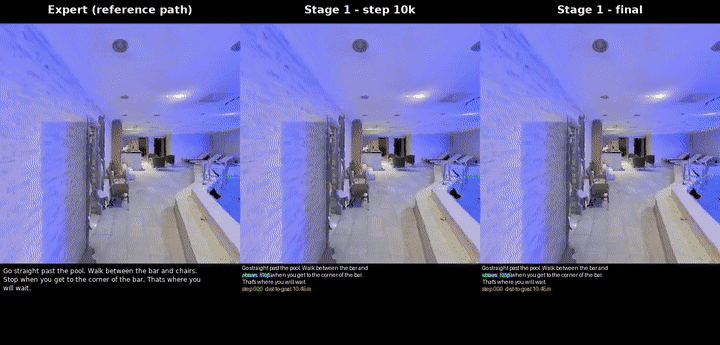<br>
  <sub>Step 10k comes within 2.8 m of the goal. The fully trained model never gets closer than 9.2 m.</sub>
</p>

<details>
<summary><b>All 11 scenes: expert vs step 10k vs final</b></summary>

| Scene | Geodesic | Step 10k: closest | Final: closest | Video |
|---|---|---|---|---|
| 2azQ1b91cZZ | 7.1 m | 3.4 m | 6.4 m | [mp4](media/comparisons/ep00_2azQ1b91cZZ_expert_vs_stage1.mp4) · [gif](media/previews/compare_ep00_2azQ1b91cZZ.gif) |
| 8194nk5LbLH | 11.8 m | 11.8 m | 11.8 m | [mp4](media/comparisons/ep01_8194nk5LbLH_expert_vs_stage1.mp4) |
| EU6Fwq7SyZv | 4.6 m | 4.3 m | 3.6 m | [mp4](media/comparisons/ep02_EU6Fwq7SyZv_expert_vs_stage1.mp4) |
| QUCTc6BB5sX | 13.2 m | 9.0 m | 11.1 m | [mp4](media/comparisons/ep03_QUCTc6BB5sX_expert_vs_stage1.mp4) |
| TbHJrupSAjP | 9.7 m | 9.7 m | 9.1 m | [mp4](media/comparisons/ep04_TbHJrupSAjP_expert_vs_stage1.mp4) |
| X7HyMhZNoso | 10.1 m | 8.8 m | 8.0 m | [mp4](media/comparisons/ep05_X7HyMhZNoso_expert_vs_stage1.mp4) |
| Z6MFQCViBuw | 11.5 m | 11.5 m | 11.5 m | [mp4](media/comparisons/ep06_Z6MFQCViBuw_expert_vs_stage1.mp4) |
| oLBMNvg9in8 | 11.0 m | 11.0 m | 11.0 m | [mp4](media/comparisons/ep07_oLBMNvg9in8_expert_vs_stage1.mp4) |
| pLe4wQe7qrG | 4.5 m | 4.5 m | 4.5 m | [mp4](media/comparisons/ep08_pLe4wQe7qrG_expert_vs_stage1.mp4) |
| x8F5xyUWy9e | 10.5 m | **2.8 m ✓** | 9.2 m | [mp4](media/comparisons/ep09_x8F5xyUWy9e_expert_vs_stage1.mp4) |
| zsNo4HB9uLZ | 8.0 m | 8.0 m | 6.3 m | [mp4](media/comparisons/ep10_zsNo4HB9uLZ_expert_vs_stage1.mp4) |

"Closest" is the minimum distance to the goal; when it equals the geodesic, the agent never got closer than its start.
The step-10k policy is from an earlier run with the same configuration, whose checkpoint was later overwritten.
</details>

#### What failed: the fully trained model

**The symptom.** The final model wanders and almost never stops. It reached the goal region in 10.7 % of 150 unseen
episodes; a control with the future-prediction part switched off (identity `G_ψ`) reached 17.3 %. In the 11 recorded
scenes it reached 3 m of the goal in none, while the earlier step-10k checkpoint reached it in one.

**The cause, measured: during training the Pilot slot leaks the answer.** LatentPilot trains with the slot filled by
the *true* embedding of the **next** frame, and at test time fills it with the model's own prediction. The next frame
shows the result of the current action (whether the view rotated or moved forward), so during training the action can
be read off the slot.

We tested this directly ([`scripts/test_slot_shortcut.py`](scripts/test_slot_shortcut.py)). The trained models replay
4,306 held-out expert steps in 11 unseen buildings four times, and only the content of the Pilot slot changes between
runs:

| Model | true next frame (training input) | its own latent (test-time input) | current frame | another episode's next frame |
|---|---|---|---|---|
| Stage 0′ (slot sees the next frame, no prediction loss) | 82.0 % | 56.6 % | 44.5 % | 27.8 % |
| **Stage 1, learned `G_ψ`** | **84.3 %** | **30.8 %** | 45.1 % | 27.8 % |
| Stage 1, identity `G_ψ` (control) | 63.1 % | 61.2 % | 63.2 % | 62.1 % |
| Stage 2, 50 % own latents | 84.3 % | 33.6 % | 53.0 % | 27.9 % |
| Stage 2, 75 % own latents | 83.7 % | 33.9 % | 54.5 % | 27.6 % |
| Stage 2, 75 %, 3× longer (7,800 steps) | 84.2 % | 35.5 % | 55.9 % | 29.6 % |
| *reference: Stage 0, no slot at all* | | | | *66.0 %* |

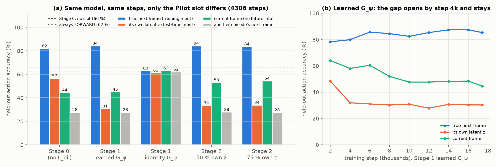<br>
<sub><b>Figure 1. The Pilot-slot shortcut, measured.</b> (a) Held-out action accuracy of each checkpoint when only the content of the Pilot slot changes (4,306 unseen steps). Every model trained with the true next frame in the slot collapses when given its own latent, both Stage 2 runs included; the identity control does not care what the slot holds. (b) The learned Stage 1 model over training: own-latent accuracy collapses by step 4k and stays low while next-frame accuracy stays high.</sub>

- **The same model drops from 84 % to 31 %** when its slot holds what it actually gets at test time. That is less
  than half the accuracy of a model with no slot at all (66 %), so the Pilot slot does not merely fail to help: it
  actively misleads the policy.
- **It is reading the slot, not the image.** With another episode's next frame in the slot, accuracy falls to 28 %.
- **The leak comes from the training input, not the prediction loss.** Stage 0′ never trained `G_ψ` and already
  leans on the slot (82 % vs 57 %). Learning to predict the future makes the test-time input *worse* (57 % → 31 %).
- **The identity control ignores the slot** (about 62 % whatever it holds), so it has nothing to lose at test time.
  That is why it navigates better.
- **The gap opens early** (panel b): own-latent accuracy falls from 48 % to 32 % between steps 2k and 4k, then stays
  flat while training accuracy keeps rising.

**Stage 2 (scheduled sampling), the paper's fix, helps navigation a little but does not remove the shortcut, even
when run 3× longer.** The fine-tune from the project's plan (2,600 steps, starting from Stage 1) replaces 50 % or 75 %
of slot inputs with the model's own latents during training. In closed loop it lifts navigation from 10.7 % to
**16.7 % and 18.0 %**, the level of the identity control. Offline, the model still scores 84 % with the true next frame
and only 34 % with its own latent. Tripling the schedule (7,800 steps at 75 %) barely moves either number: own-latent
accuracy 35.5 %, OS **19.3 %** (within noise of 18.0 % at n = 150), and the agent never issues STOP. More scheduled
sampling on expert trajectories does not close the gap; the paper's data flywheel, which trains on the model's own
trajectories, was not run.

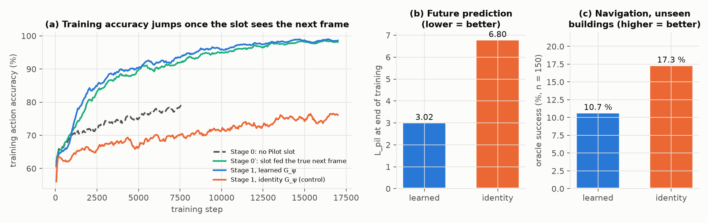<br>
<sub><b>Figure 2. The failure seen during training.</b> (a) Training accuracy jumps once the Pilot slot is fed the true next frame. (b) The learned Pilot Token predicts the future better than the identity control, yet (c) navigates worse in unseen buildings.</sub>

**A contributing cause: the loss balance drifts.** With λ = 0.1 the future-prediction loss ends up with 5.5× the action
loss's weight (below). An adaptive λ removed the drift but did **not** recover navigation (OS 6.7 %), so the drift is
not the main problem.

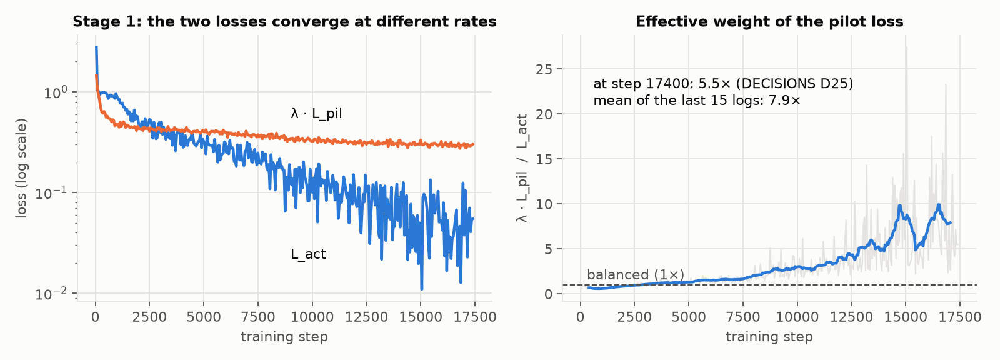<br>
<sub><b>Figure 3. Stage 1 loss balance (λ = 0.1).</b> Left: the action loss and the future-prediction loss. Right: their weighted ratio λ·L_pil / L_act, which starts at about 0.5 and ends 5.5× larger, so the prediction term gradually dominates.</sub>

**What this means for the method.** LatentPilot's appeal (one latent per step instead of history frames or text) rests
on the model learning to *use its own* latent. Trained as specified in Stage 1, it instead learns to read the
privileged next frame, which it never sees at test time. Our results cover Stage 1 plus Stage 2 fine-tunes of up to 7,800 steps at 2 B
parameters and 6 buildings. The paper's full flywheel, which trains on the model's own trajectories over several rounds,
was not run.

### ② Pointing + controller (inspired by Robostral Navigate)

**Why try it.** [Robostral Navigate](https://arxiv.org/abs/2607.20785) by **Mistral AI** points at the next waypoint
in the camera image instead of classifying an action. This turns navigation into the grounding problem VLMs are
pretrained for. Their 8 B model is trained on 2.4 M simulated trajectories and then fine-tuned with **online RL**. It
reports 73.4 % success with supervised training alone and 77.4 % after RL. We tested the idea's **raw capability**:
- a 2 B model;
- 61 buildings (10.8 k episodes);
- supervised learning only, **no RL fine-tuning**;
- a simple geometric controller in place of their learned low-level policy.

**What you're seeing.** The pointing policy driving on its own:
- the **cyan cross-hair** is where the model wants to go next, and the controller turns toward it;
- a **green cross-hair**, when shown, is the expert's actual next waypoint;
- `p(stop)` is its STOP probability;
- a **red border** marks a failed episode.

| Never approaches the goal | Passes within 0.5 m, never stops | Passes 1.5 m from the goal, stops 5.4 m away |
|---|---|---|
| 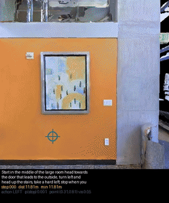 | 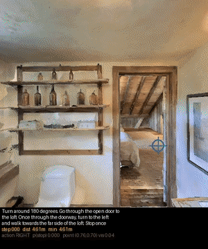 | 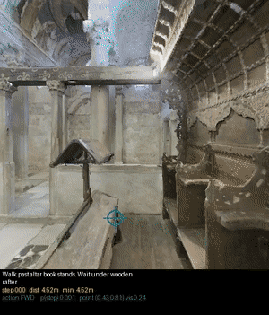 |

(Recordings of the step-100k checkpoint: it succeeded in 6 of 22 recorded episodes; [all 16 failures](media/rollouts/step100k_failures/).)

#### What failed, and why

**First, an honest headline.** The STOP threshold is now chosen on `val_seen` (8 training buildings, new episodes),
not on the test split. That picks τ = 0.10 and gives **SR 23.3 %** on `val_unseen`, within a point of the 22.7 % from
test-set tuning (see the threshold figure under Results). The earlier runs were also re-evaluated with stopping
positions logged: 12.7 % (16 scans), 17.3 % (+ history) and 22.7 % (longer schedule). Layer fusion matches the plain
longer schedule rather than beating it.

**How the best model's 150 episodes end** (panel a below):
- **22.7 %** stop within 3 m of the goal (success);
- 8.7 % run out of steps near the goal;
- 23.3 % stop in the wrong place;
- 45.3 % run out of steps far away.

There are three causes, in order of impact:
1. **It under-turns.** When the expert turns, the model predicts FORWARD 39–43 % of the time and almost never the wrong
   direction (panel b). The predicted bearing is only 0.42× the true one (second figure). A regression head trained on
   targets that are usually "straight ahead" learns to hedge toward straight. The first GIF is this: an early turn is
   missed and the agent never recovers.
2. **STOP is weak.**
   - STOP is only 2.5 % of the training labels.
   - The signal is readable in the middle of the network (layer 15, AUC 0.72) but not at the output layer (0.44).
   - Only 49 % of its own stops land within 3 m.
   The second and third GIFs are the two sides of this: it passes the goal without stopping, or it stops at a
   look-alike spot.
3. **It never learned to recover.** Supervised imitation only ever sees expert states. Robostral's RL phase exists to
   teach recovery from the model's own mistakes, and we did not run it.

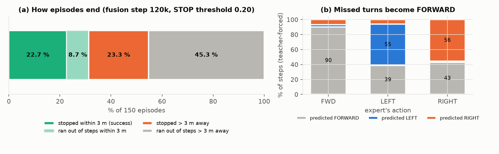<br>
<sub><b>Figure 4. How pointing fails (layer fusion, step 120k, τ = 0.20, n = 150).</b> (a) How the episodes end: 22.7 % stop within 3 m, 8.7 % run out of steps within 3 m, 23.3 % stop more than 3 m away and 45.3 % run out of steps far from the goal. (b) Teacher-forced predictions grouped by the expert's action: 39–43 % of the expert's turns are predicted as FORWARD.</sub>

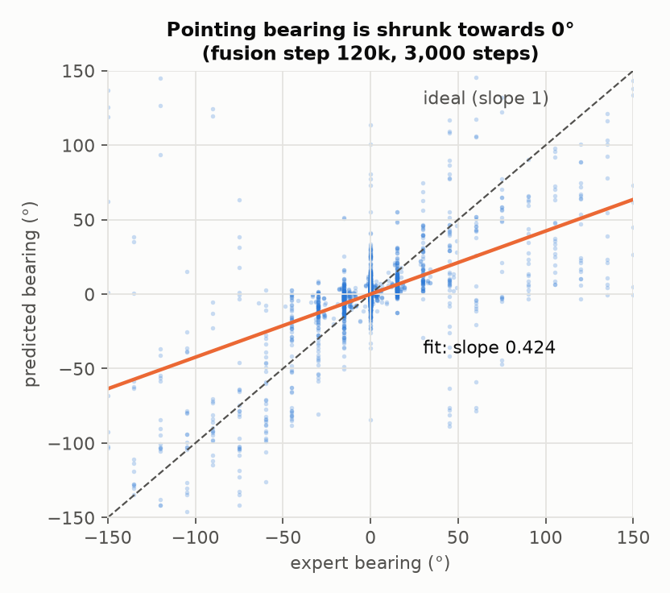<br>
<sub><b>Figure 5. Predicted turns are too shallow.</b> Predicted vs expert bearing on 3,000 teacher-forced steps (fusion, step 120k). The fitted slope is 0.42: the model turns less than half as sharply as the expert, so many turns fall under the 7.5° threshold and become FORWARD.</sub>

### ③ Cosmos3-Edge action model (video diffusion, zero-shot)

**Why try it.** NVIDIA's video world model has an action stream trained to produce camera and robot motion from video.
If that motion prior transfers, it could supply what a small VLM lacks. We used it **zero-shot**, with no training at
all.

**What you're seeing** (no videos were recorded; this is a measurement figure).
- **Left:** given "turn left" or "turn right", how often the model turns the right way as the guidance strength rises.
- **Right:** with full R2R instructions, how often its turn direction matches the expert. Blue bars use the right
  instruction; orange bars use another episode's instruction as a control.

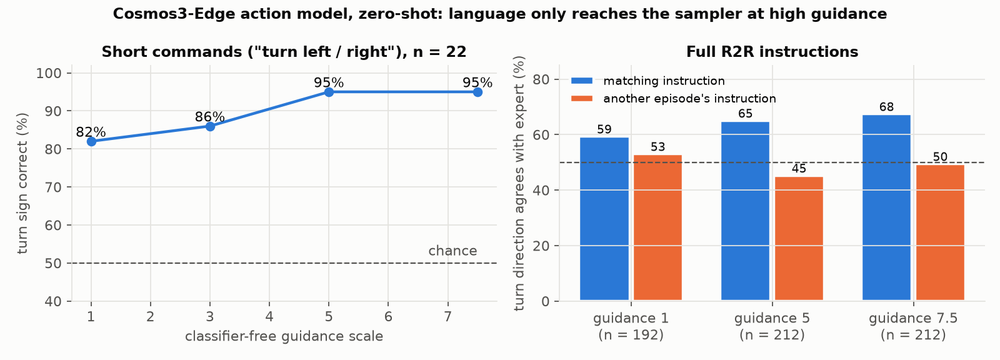<br>
<sub><b>Figure 6. Cosmos3-Edge action model, zero-shot.</b> Language changes the sampled motion only at high classifier-free guidance, and full instructions steer it weakly: the model recovers ego-motion from video but largely ignores what it is told.</sub>

#### What failed, and why

**The symptom.** It reached the goal region in only 7.5 % of 40 episodes. 75 % of episodes ended early.

**Cause 1: it ignores the instruction.** At normal guidance, the right and wrong instructions score about the same
(59 % vs 53 %). Even at guidance 7.5, turn direction matches the expert only 68 % of the time. Its action captions in
pretraining are short motion or scene descriptions, not multi-sentence routes. A fixed prompt, "The camera moves
forward.", did at least as well as the real instruction (15 % vs 7.5 %).

**Cause 2: it stalls.** The motion prior is real (yaw correlation 0.84–0.99 with our camera motion). But its sampled
motion chunks often contain too little movement to become even one step. Two such chunks in a row end the episode,
which is why most episodes stop early.

### ④ Cosmos3-Edge reasoner as the policy (decision probes)

**Why try it.** A reasoning VLM trained on physical video might decide "what next?" better than an action classifier.
It can also see how the view has changed over the last few seconds. Zero-shot it did not work: asked for the next
action, it described the room as a bystander ("A person enters the room through the archway…"). We therefore
fine-tuned it on expert decisions. There are two versions:

| Version | Training data | Video it sees |
|---|---|---|
| **SFT v1** | over-samples turns and stops (25 % STOP labels) | the last ~1 s |
| **SFT v3** | uniformly sampled decisions (5 % STOP labels) | the last 8 s |

(A v2 run was stopped after 200 steps and never evaluated.)

**What you're seeing.** Each clip shows **one** model. It plays exactly the video that model is given at one moment
of an **expert's** walk; the model is not driving. The clip then freezes and shows the question, what the expert did,
and that model's answer.

| | SFT v1 | SFT v3 |
|---|---|---|
| **Case A: at the goal.** The expert stops. | 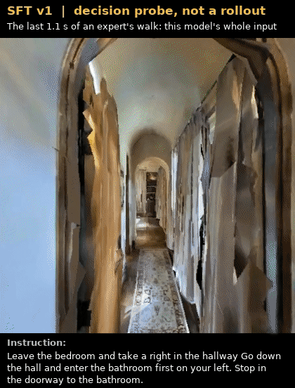<br>v1: **stop ✓** | 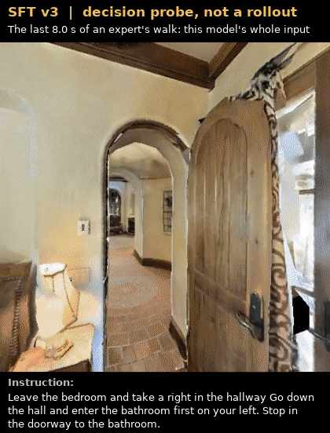<br>v3: **move forward ✗** |
| **Case B: mid-route.** The expert goes forward. | 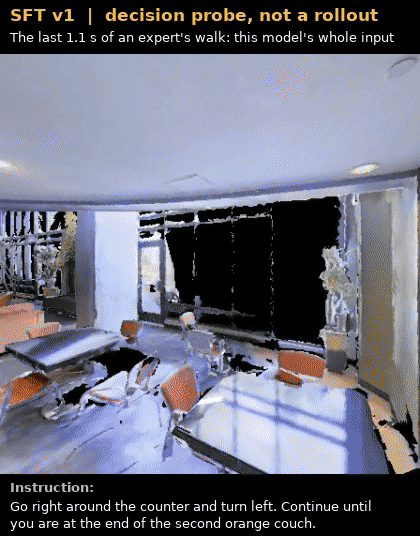<br>v1: **turn left ✗** | 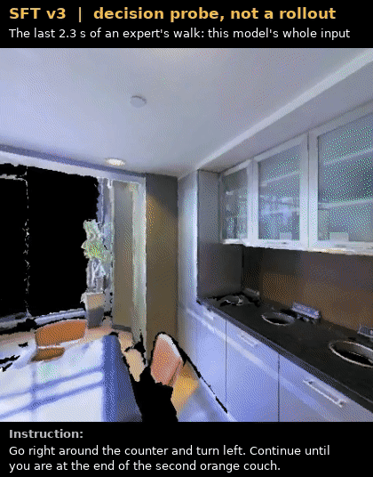<br>v3: **move forward ✓** |

#### What failed, and why

**The symptom.** v3 reaches the goal region about as often as the best pointing model, but it almost never stops
there.
Measured over three strict runs (n = 40 each, the episode only ends at its own STOP or the step limit), its **success
rate is 3.3 %** (2.5, 2.5 and 5.0 %), while it comes within 3 m in 37.5 % of episodes. Its reaching score also varies
between runs: three diagnostic runs gave 47.5, 47.5 and 35.0 %, so ±15 points at n = 40 is real. v1 ended 65 % of its
episodes by saying STOP, always in the wrong place.

**Most plausible cause: each version reproduces its training label mix** (figure below). v1 trained on 25 % STOP
labels and stops constantly. v3 trained on 5 % and almost never stops, so its episodes end by running out of steps
(40 %). Deciding to stop also requires knowing *how much of the instruction is done*. With at most 8 s of video and no
memory beyond that, neither version can know this. Fine-tuning on expert frames only, with no closed-loop training,
means it never practised recovering from its own errors. Its offline next-action accuracy (63–68 %) did not predict
closed-loop success.

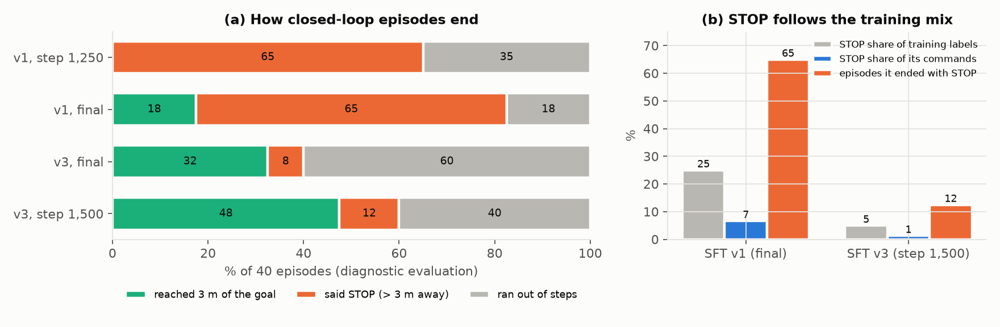<br>
<sub><b>Figure 7. How the reasoner fails.</b> (a) How the 40 closed-loop episodes end (diagnostic evaluation). (b) STOP behaviour follows the share of STOP in the training labels: v1 (25 % STOP labels) ends 65 % of episodes with a STOP, mostly far from the goal; v3 (5 %) says STOP in 1 % of its commands and usually runs out of steps.</sub>

Before fine-tuning, on still frames, the reasoner could sketch a plausible route:

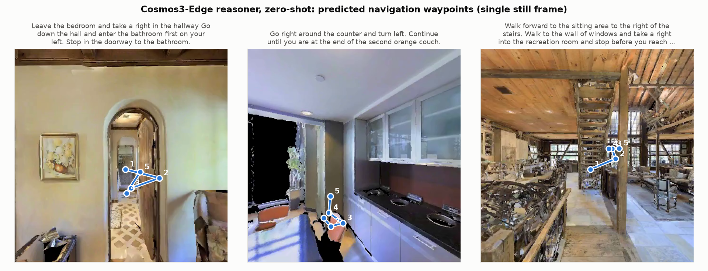<br>
<sub><b>Figure 8. Zero-shot reasoner on still frames.</b> Navigation waypoints the untuned model predicts on single frames (coordinates normalised to 0–1000). The routes look plausible on still images.</sub>

All media is listed in [`media/README.md`](media/README.md). It is Matterport3D-derived and for non-commercial
academic use only.

---

## Results

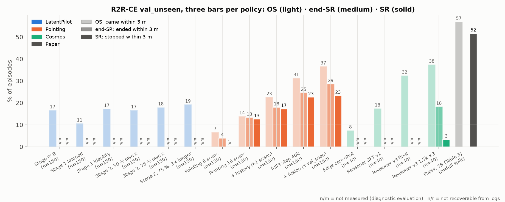<br>
<sub><b>Figure 9. Closed-loop results on R2R-CE val_unseen.</b> Three bars per policy, loosest to strictest: OS (came within 3 m, light), end-SR (ended within 3 m, medium) and SR (stopped within 3 m by its own STOP, solid). n/m = not measured: those runs ended the episode on arrival. The reasoner bars average three strict runs; the paper's 7B row is for reference.</sub>

**Three success metrics, from strictest to loosest:**
- **SR:** the agent's own STOP was within 3 m of the goal. This is the standard R2R-CE definition.
- **end-SR:** the episode *ended* within 3 m, by STOP or by running out of steps. Our "strict" runs originally reported
  this number as SR.
- **OS:** the agent came within 3 m at any point (oracle success).

Most evaluations ended the episode as soon as the agent came within 3 m, so they measure only OS. SR can be recovered
from the logs only where the stopping position was recorded.

| Approach | Variant | n (scans) | SR | end-SR | SPL* | OS | nDTW | NE (m) |
|---|---|---|---|---|---|---|---|---|
| ① Latent reasoning | Stage 1, learned `G_ψ` (as specified) | 150 (8) | n/m | n/m | — | 10.7 | 0.277 | 8.50 |
| ① Latent reasoning | identity `G_ψ` control | 150 (8) | n/m | n/m | — | 17.3 | 0.268 | 8.17 |
| ① Latent reasoning | + Stage 2, 50 % own latents | 150 (8) | n/m | n/m | — | 16.7 | 0.312 | 7.98 |
| ① Latent reasoning | + Stage 2, 75 % own latents | 150 (8) | n/m | n/m | — | 18.0 | 0.315 | 7.99 |
| ① Latent reasoning | + Stage 2, 75 %, 3× longer | 150 (8) | n/m | n/m | — | 19.3 | 0.298 | 7.86 |
| ② Pointing | 16 scans, final layer | 150 (8) | 12.7 | 13.3 | 13.0 | 14.0 | 0.350 | 7.34 |
| ② Pointing | + history, 61 scans | 150 (8) | 17.3 | 18.0 | 16.8 | 22.7 | 0.394 | 6.55 |
| ② Pointing | + longer schedule (step 40k) | 150 (8) | 22.7 | 24.7 | 22.3 | 31.3 | 0.345 | 7.10 |
| ② Pointing | + layer fusion (step 120k), τ = 0.20 tuned on test | 150 (8) | 22.7 | 31.3 | 25.4 | 42.7 | 0.323 | 7.22 |
| ② Pointing | **+ layer fusion, τ = 0.10 chosen on `val_seen`** | 150 (8) | **23.3** | 28.7 | 24.3 | 36.7 | 0.363 | 7.03 |
| ③ Edge action model | zero-shot, guidance 7.5 | 40 (6) | n/m | n/m | — | 7.5 | 0.276 | 8.81 |
| ④ Edge reasoner | SFT v1 | 40 (6) | n/m | n/m | — | 17.5 | 0.365 | 7.41 |
| ④ Edge reasoner | SFT v3, step 1,500 (3 diagnostic runs) | 40 (6) | n/m | n/m | — | **43.3** ± 7.2 | 0.364 | 6.36 |
| ④ Edge reasoner | **SFT v3, step 1,500 (3 strict runs)** | 40 (6) | **3.3** | 18.3 | 12.6 | 37.5 | 0.175 | 7.31 |
| *LatentPilot paper* | *7 B, full split, with flywheel* | 1,839 (11) | *51.7–54.0* | — | *47.1–48.5* | *57.0* | — | *5.3* |
| *Robostral Navigate* | *8 B, 2.4 M trajectories, SFT + RL* | 1,839 (11) | *77.4* | — | — | — | — | — |

- n/m: not measured, because the evaluation ended on arrival.
- \* SPL uses end-SR as its success criterion.
- Reasoner rows average three runs. Decoding is stochastic, and ± is the standard deviation across those runs.
- The pointing row in bold uses a STOP threshold chosen on `val_seen` (8 training buildings, 159 new episodes), so
  nothing about it was tuned on the test split. The other pointing rows use thresholds of 0.05–0.20 chosen on
  `val_unseen`.

Every evaluation is listed in [`docs/EXPERIMENT_LOG.md` §3](docs/EXPERIMENT_LOG.md#3-consolidated-navigation-evaluations-r2r-ce-val_unseen).

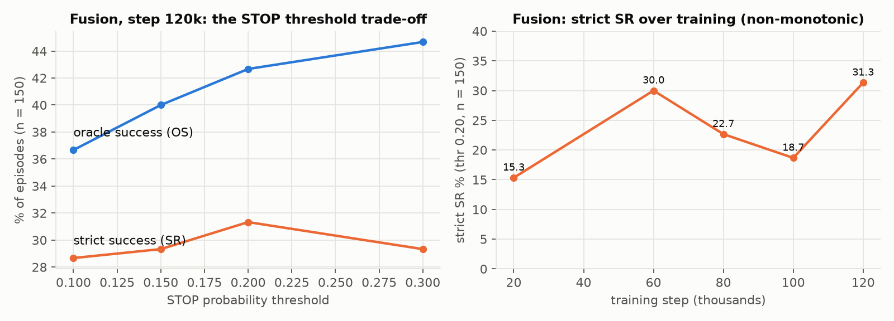<br>
<sub><b>Figure 10. Choosing the STOP threshold (pointing, layer fusion).</b> Left: raising the threshold τ trades premature stops for overshoots. OS keeps rising, end-SR peaks at 0.20, and SR is flat up to 0.20, then falls. The headline τ = 0.10 was chosen on val_seen, not on the test split. Right: end-SR and SR over training at τ = 0.20 (stopping positions were not logged at 20k).</sub>

## Key findings

1. **Training on the privileged next frame teaches a shortcut, and we measured it.** On held-out steps, LatentPilot's
   Stage 1 model is 84 % accurate when its Pilot slot holds the true next frame (its training input), and 31 % when it
   holds its own latent (its test-time input). That is less than half the 66 % of a model with no slot at all. Stage 2
   (scheduled sampling) recovered some navigation (10.7 → 18.0 % OS) but not the shortcut (34 %), and a 3× longer
   run left both almost unchanged (35.5 %, OS 19.3 %).
2. **Stopping, not reaching, is the bottleneck for every approach.** The best pointing model came within 3 m in 36.7 %
   of episodes and stopped there in 23.3 %. The reasoner came within 3 m in 37.5 % and stopped there in 3.3 %.
3. **Choosing the threshold properly barely moved the headline.** Picked on `val_seen` instead of the test split, the
   pointing policy scores 23.3 % SR vs 22.7 % tuned on test, so the result was not an artefact of tuning.
4. **Offline probes picked the wrong model twice.** Once for the Pilot-slot design, once for the reasoner version.
   Rank policies closed-loop.
5. **The STOP decision lives mid-network.** A linear probe reads it at AUC 0.72 in layer 15, but 0.44 at the output
   layer. A head reading layers 23/26/28 did not, however, raise SR: the fused model at 120k and the final-layer head at
   40k both reach 22.7 %.

   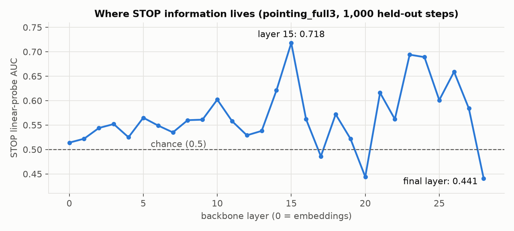<br>
   <sub><b>Figure 11. Where the STOP decision lives.</b> STOP linear-probe AUC per backbone layer (`pointing_full3`, before layer fusion; 1,000 held-out steps). It peaks at layer 15 (0.72) and is below chance at the final layer (0.44), the one the pointing head was reading.</sub>

6. **Data first.** Going from 6 to 16 buildings tripled the pointing policy's success. Fixing three silent label bugs
   raised label/expert agreement from 0.69 to 0.97.
7. **Silent bugs rivalled any modelling change.** Examples:
   - mRoPE dropped with `inputs_embeds`;
   - bf16 targets that depend on batch size;
   - the paper's literal token layout (21 % vs 78 % instruction following);
   - a history stride trained wrong for 7 h;
   - a success metric that did not require STOP.

   See [`docs/GOTCHAS.md`](docs/GOTCHAS.md).

The full narrative, one section per experiment with why it was run, the setup, the result and the decision, is in
**[`docs/EXPERIMENTS.md`](docs/EXPERIMENTS.md)**.

## Caveats

- **SR definition.** Our "strict" runs counted an episode as successful if it *ended* within 3 m, including by running
  out of steps. Standard SR also requires the agent's own STOP. Both are reported. Every pointing row was re-evaluated
  with stopping positions logged; only the 6-scan ablation was not.
- **Raw capability only.** Each method got one offline round of imitation learning. There was no data flywheel
  (LatentPilot), no RL fine-tuning (Robostral) and no DAgger, so none of the numbers is the method's ceiling.
- **Thresholds.** The headline pointing result uses a STOP threshold chosen on `val_seen`. The other pointing rows and
  the turn threshold (7.5°) were chosen on `val_unseen`, so those are mildly optimistic.
- **Small, unpaired evaluations.** Evaluations use n = 150 (8 scans) for ① and ②, and n = 40 (6 scans) for ③ and ④.
  Each takes the first n episodes of the split, so the episode sets differ. At n = 40, the 95 % interval is roughly
  ±15 points.
- **The reasoner decodes stochastically** (top-p 0.8, temperature 0.7). Its rows average three runs each, and its
  reaching score varied from 35 % to 47.5 % between runs. Its v1 → v3 change altered three things at once.
- **Unfinished runs.** The long pointing runs were stopped at 1.1–1.2 of their planned 1.5–3 epochs. Stage 2 was run
  only as a fine-tune on expert data (2,600 and 7,800 steps, at most 75 % own latents). A 16-scan Stage 1 and most Cosmos ablation arms were never run
  ([list](docs/EXPERIMENTS.md#6-planned-but-not-run)).
- **Different backbone and scale from the paper** (2 B vs 7 B parameters, 6–61 scans vs full data). These results
  describe this scale; they do not settle whether the paper is right.

## Model zoo

Every trained model reported in the paper has a model card in Hugging Face format ([`model_cards/`](model_cards/README.md)).
Weights are not published yet (each is a 25–33 MB LoRA adapter).

| Model | Approach | Base model | Result on R2R-CE `val_unseen` | Card |
|---|---|---|---|---|
| `pointing_fusion/step120000` | ② pointing + controller | Cosmos-Reason2-2B | **SR 23.3 %** at τ chosen on `val_seen` (OS 36.7 %; n = 150) | [card](model_cards/pointing-fusion-2b/README.md) |
| `reasoner_sft_v3/step1500` | ④ Cosmos3-Edge reasoner | Cosmos3-Edge | SR 3.3 %, OS 37.5 % (3 strict runs, n = 40) | [card](model_cards/reasoner-sft-v3/README.md) |
| `stage1_learned/final`, `stage1_identity/final`, `stage2_p50/final`, `stage2_p75/final`, `stage2_p75_long/final` | ① LatentPilot | Cosmos-Reason2-2B | OS 10.7 / 17.3 / 16.7 / 18.0 / 19.3 % (n = 150, diagnostic) | [card](model_cards/latentpilot-stage1-2b/README.md) |

## Reproduction

Two conda environments are needed, because no habitat-sim build supports Python 3.10:

| Env | Python | Contains | Used for |
|---|---|---|---|
| `latentpilot` | 3.10 | torch 2.5.1 (CUDA 12.1), transformers 5.16, peft 0.20, diffusers 0.40 | model code, training, evaluation driver |
| `habitat_render` | 3.9 | habitat-sim 0.3.3 (headless, with Bullet) | rendering and simulation (separate worker process) |

Exact versions are pinned in [`environment/`](environment/).

```bash
conda env create -f environment/latentpilot.yml
conda env create -f environment/habitat_render.yml
# the shell scripts read these (default: `python` on PATH)
export PY=$(conda run -n latentpilot which python)
export HABITAT_PYTHON=$(conda run -n habitat_render which python)

PYTHONPATH="" python -m pytest tests/ -q          # 311 tests, one file per equation group
python scripts/verify_env.py                       # backbone loads, d = 2048, N_v = 196, VRAM
conda activate habitat_render && python scripts/verify_habitat.py --scene <scene .glb>

# data: Matterport3D (terms of use required) + R2R-CE, expert rollouts
export MP3D_HABITAT_URL=<link emailed to you after signing the Matterport3D terms>
python scripts/download_mp3d.py && bash scripts/download_full.sh && bash scripts/collect_full.sh

# ① LatentPilot
bash scripts/run_ab_overnight.sh                   # Stage 0' designs A and B
bash scripts/run_stage1.sh                         # Stage 1: learned vs identity G_psi

# ② Pointing: best strict result
bash scripts/run_fusion.sh                         # K=2 stride 8, head reads layers 23/26/28
python scripts/eval_pointing.py --checkpoint checkpoints/pointing_fusion/step120000 \
    --limit 150 --strict --stop-threshold 0.20

# ③ Cosmos3-Edge action model, zero-shot
python scripts/render_resampled.py --split val_unseen --limit <N>   # 15 fps video + 9-D action labels
python scripts/eval_edge.py --limit 40             # guidance 7.5, chunk 24 (see the script header)

# ④ Cosmos3-Edge reasoner
python scripts/train_reasoner_sft.py ...           # see the script header for the v3 settings
bash scripts/eval_v3.sh

# follow-up experiments (slot-shortcut test, Stage 2, strict re-evaluations, val_seen threshold)
python scripts/download_mp3d.py --accept-terms --scans <scans>   # only the buildings you need (~80 MB each)
bash scripts/run_slot_shortcut.sh                                # held-out Pilot-slot test (~1 h)
bash scripts/run_pending_followups.sh                            # everything else; safe to run from cron (see its header)

# figures and demo media, from logs and recordings already on disk (no GPU)
python tools/make_figures.py && python tools/make_demo_media.py
```

Hardware: one RTX 4070 Ti SUPER (16 GB). The 2 B backbone in bf16 takes ≈ 4.6 GB. The reasoner (4.5 GB) and the Edge
action pipeline (7.6 GB) fit together.

## Repository layout

```
src/model/       ① Eq. 3–8: vision encoder, action space, input sequence, backbone (explicit mRoPE), action head,
                 Pilot Token; ② pointing head
src/losses/      ① Eq. 13–15: L_act, L_pil
src/data/        rollout collection (reference-path follower), v̄ caching, pointing targets, Cosmos datasets
src/eval/        NE / SR / OS / SPL / nDTW; the Habitat worker runs in its own process; chunk → primitives
src/train/       ① Stage 0 / 0′ / 1 / 2, ② pointing training (LoRA), Cosmos sequence packing
src/nav/         ③④ Cosmos3-Edge navigator (reasoner + action pipeline), prompts with provenance, reasoner SFT data
scripts/         download, collection, training, evaluation, sweeps, probes (each header says why the script exists)
scripts/archive/ one-off orchestration scripts (queueing, hand-offs, catch-up evals), kept as provenance
tools/           make_figures.py (docs/figures from logs), make_demo_media.py (demo videos from recordings)
tests/           one test file per equation group (311 tests)
results/         probe reports and closed-loop run summaries (JSON)
logs/            every training and evaluation log (text)
website/         project page (index.html); deployed to GitHub Pages by .github/workflows/pages.yml
model_cards/     Hugging Face-format model cards for every trained model
environment/     pinned conda / pip environments
paper/           technical report: main.tex, references.bib (53 entries), figures/, main.pdf (build: make -C paper)
docs/            EXPERIMENTS.md (narrative), EXPERIMENT_LOG.md (every number + source), REFERENCES.md, EQUATIONS.md,
                 GOTCHAS.md, figures/
media/           rollout videos, comparisons and previews (Matterport3D-derived, non-commercial)
DECISIONS.md     every design decision and deviation from the paper, with the measurement behind it
HANDOFF.md       session state through Stage 0′;  Agents.md: ground rules the work followed
```

Suggested reading order: this README → [`paper/main.pdf`](paper/main.pdf) → [`docs/EXPERIMENTS.md`](docs/EXPERIMENTS.md) → [`DECISIONS.md`](DECISIONS.md)
→ [`docs/GOTCHAS.md`](docs/GOTCHAS.md).

## Data and checkpoints (not in this repository)

| What | Size | How to get it |
|---|---|---|
| Matterport3D scenes for Habitat | 32 GB for 17 scans (11 val_unseen + 6 train); more for all 72 | accept the [Matterport3D terms](http://kaldir.vc.in.tum.de/matterport/MP_TOS.pdf), then set `MP3D_HABITAT_URL` to the link you are emailed and run `python scripts/download_mp3d.py` (resumable, verifies before extracting) |
| R2R-CE episodes | small | VLN-CE release (`scripts/download_full.sh`) |
| Expert rollouts, rendered frames, resampled video | ~42 GB | regenerate with `scripts/collect_full.sh`, `scripts/render_resampled.py` |
| Base models | — | Hugging Face `nvidia/Cosmos-Reason2-2B`, `nvidia/Cosmos3-Edge` |
| Trained LoRA adapters | ~12.5 GB | not published; kept by the author |

## Citation

If you use this code, results or media, please cite the report (GitHub's **"Cite this repository"** button reads
[`CITATION.cff`](CITATION.cff)):

```bibtex
@techreport{jain2026evaluatingvln,
  title       = {Evaluating Different Approaches to Vision-and-Language Navigation: An Experimental Study on a Single GPU},
  author      = {Jain, Shubh},
  year        = {2026},
  month       = {9},
  institution = {GitHub},
  url         = {https://github.com/ShubhJain007/evaluating-different-approaches-to-vln}
}
```

Please also cite the work this builds on. The core references are below; all 53 are listed in
[`docs/REFERENCES.md`](docs/REFERENCES.md), with BibTeX in [`paper/references.bib`](paper/references.bib).

| Role in this project | Work |
|---|---|
| Method reimplemented (①, latent reasoning) | Hao et al., *LatentPilot*, [arXiv:2603.29165](https://arxiv.org/abs/2603.29165) |
| Inspiration for ② (Mistral AI) | Bounhar et al., *Robostral Navigate*, [arXiv:2607.20785](https://arxiv.org/abs/2607.20785) |
| Related latent-token method | Qin et al., *Chain-of-Visual-Thought*, [arXiv:2511.19418](https://arxiv.org/abs/2511.19418) |
| Task and data | Anderson et al., *R2R*, [arXiv:1711.07280](https://arxiv.org/abs/1711.07280); Krantz et al., *VLN-CE*, [arXiv:2004.02857](https://arxiv.org/abs/2004.02857) |
| Scenes and simulator | Chang et al., *Matterport3D*, [arXiv:1709.06158](https://arxiv.org/abs/1709.06158); Savva et al., *Habitat*, [arXiv:1904.01201](https://arxiv.org/abs/1904.01201) |
| Metrics | Anderson et al., *SPL*, [arXiv:1807.06757](https://arxiv.org/abs/1807.06757); Ilharco et al., *nDTW*, [arXiv:1907.05446](https://arxiv.org/abs/1907.05446) |
| Backbones (①②) | NVIDIA, [Cosmos-Reason2-2B](https://huggingface.co/nvidia/Cosmos-Reason2-2B); Wang et al., *Qwen2-VL*, [arXiv:2409.12191](https://arxiv.org/abs/2409.12191); Tschannen et al., *SigLIP 2*, [arXiv:2502.14786](https://arxiv.org/abs/2502.14786) |
| Models (③④) | NVIDIA, [Cosmos3-Edge](https://huggingface.co/nvidia/Cosmos3-Edge); NVIDIA, *Cosmos WFM*, [arXiv:2501.03575](https://arxiv.org/abs/2501.03575); NVIDIA, *Cosmos-Reason1*, [arXiv:2503.15558](https://arxiv.org/abs/2503.15558) |
| Fine-tuning | Hu et al., *LoRA*, [arXiv:2106.09685](https://arxiv.org/abs/2106.09685) |

## Licences

| What | Licence |
|---|---|
| Code (`src/`, `scripts/`, `tools/`, `tests/`, `website/`) | [MIT](LICENSE) |
| Report text (`paper/`) and documentation (`docs/`) | [CC BY 4.0](https://creativecommons.org/licenses/by/4.0/) |
| Rendered imagery: `media/`, and figures showing scenes (`fig_qualitative`, `fig_reasoner_zeroshot`) | derived from Matterport3D: **non-commercial academic use only**, under the [Matterport3D Terms of Use](http://kaldir.vc.in.tum.de/matterport/MP_TOS.pdf) |
| Adapters built on Cosmos-Reason2-2B / Cosmos3-Edge | subject to the base models' licences: [NVIDIA Open Model License](https://www.nvidia.com/en-us/agreements/enterprise-software/nvidia-open-model-license) / [OpenMDW-1.1](https://openmdw.ai/license/1-1/) |
| R2R / VLN-CE episodes, Habitat | their own licences (see [`docs/REFERENCES.md`](docs/REFERENCES.md)) |
