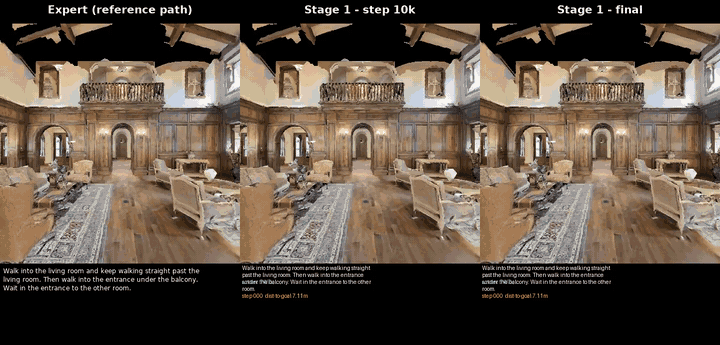
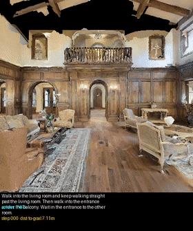
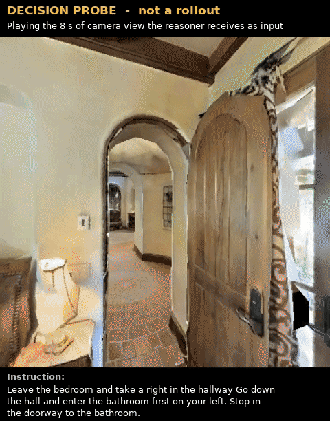
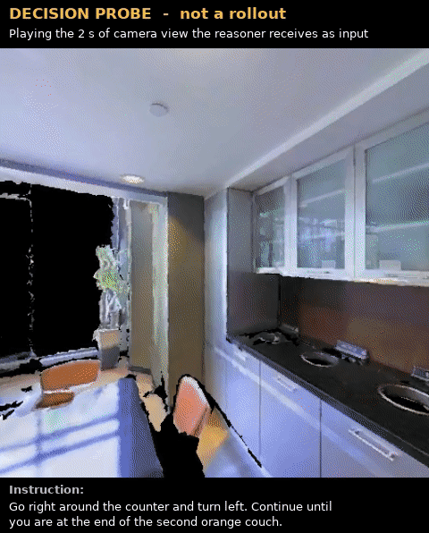
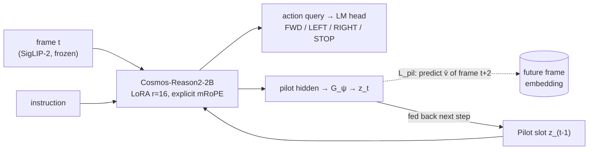
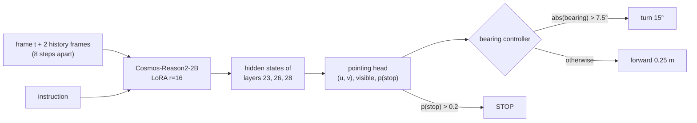
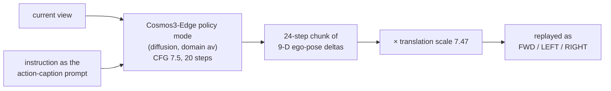
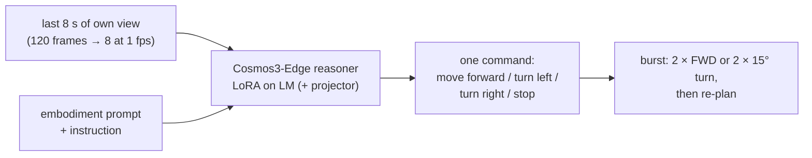

# Four Ways to Navigate: Vision-and-Language Navigation Policies on One GPU

**Four architectures for Vision-and-Language Navigation in continuous environments (R2R-CE), each built and evaluated
on a single 16 GB GPU:**

1. a latent "dream-ahead" policy (a from-scratch reimplementation of
   [LatentPilot](https://arxiv.org/abs/2603.29165));
2. a waypoint-pointing policy with a geometric controller;
3. a pretrained video-diffusion action model (Cosmos3-Edge);
4. a fine-tuned video reasoner used directly as the policy.

What worked, what failed, and why.

> **Status (Sept 2026): research code, finished and not maintained.** Results are on subsets of R2R-CE `val_unseen`
> (n = 40–150), with thresholds tuned on that split. Read [Caveats](#caveats) before quoting a number.

---

## Demos

Every video below is a closed-loop run in an **unseen** Matterport3D building. The agent hears one English instruction
and acts from its own camera. Recordings play at 4 fps. The overlay shows the instruction, distance to goal, the chosen
action and the STOP probability.

### ① LatentPilot: a better frame predictor became a worse navigator

<p align="center">
  <br>
  <sub>Same episode, three agents. Left: the expert on the reference path. Middle: LatentPilot after 10k training steps,
  which comes within 2.8 m of the goal. Right: the fully trained model, which never gets closer than 9.2 m.</sub>
</p>

<p align="center">
  <br>
  <sub>Another scene: the step-10k policy gets within 3.4 m, the final one 6.4 m.</sub>
</p>

<details>
<summary><b>All 11 scenes: expert vs LatentPilot at step 10k vs final</b> (side-by-side mp4s)</summary>

| Scene | Geodesic | Step 10k: closest | Final: closest | Video |
|---|---|---|---|---|
| 2azQ1b91cZZ | 7.1 m | 3.4 m | 6.4 m | [mp4](media/comparisons/ep00_2azQ1b91cZZ_expert_vs_stage1.mp4) |
| 8194nk5LbLH | 11.8 m | 11.8 m | 11.8 m | [mp4](media/comparisons/ep01_8194nk5LbLH_expert_vs_stage1.mp4) |
| EU6Fwq7SyZv | 4.6 m | 4.3 m | 3.6 m | [mp4](media/comparisons/ep02_EU6Fwq7SyZv_expert_vs_stage1.mp4) |
| QUCTc6BB5sX | 13.2 m | 9.0 m | 11.1 m | [mp4](media/comparisons/ep03_QUCTc6BB5sX_expert_vs_stage1.mp4) |
| TbHJrupSAjP | 9.7 m | 9.7 m | 9.1 m | [mp4](media/comparisons/ep04_TbHJrupSAjP_expert_vs_stage1.mp4) |
| X7HyMhZNoso | 10.1 m | 8.8 m | 8.0 m | [mp4](media/comparisons/ep05_X7HyMhZNoso_expert_vs_stage1.mp4) |
| Z6MFQCViBuw | 11.5 m | 11.5 m | 11.5 m | [mp4](media/comparisons/ep06_Z6MFQCViBuw_expert_vs_stage1.mp4) |
| oLBMNvg9in8 | 11.0 m | 11.0 m | 11.0 m | [mp4](media/comparisons/ep07_oLBMNvg9in8_expert_vs_stage1.mp4) |
| pLe4wQe7qrG | 4.5 m | 4.5 m | 4.5 m | [mp4](media/comparisons/ep08_pLe4wQe7qrG_expert_vs_stage1.mp4) |
| x8F5xyUWy9e | 10.5 m | **2.8 m ✓** | 9.2 m | [mp4](media/comparisons/ep09_x8F5xyUWy9e_expert_vs_stage1.mp4) |
| zsNo4HB9uLZ | 8.0 m | 8.0 m | 6.3 m | [mp4](media/comparisons/ep10_zsNo4HB9uLZ_expert_vs_stage1.mp4) |

"Closest" is the minimum distance to the goal. When it equals the geodesic, the agent never got closer than its start.
The step-10k policy comes from an earlier training run whose checkpoint was later overwritten
([details](docs/EXPERIMENTS.md#5-corrections-to-earlier-reports)). The final checkpoint in single view:


</details>

### ② Pointing policy: best true success, and its three failure modes

The policy draws a cross-hair (cyan) where it wants to go next, and a controller turns toward it. At step 100k it
succeeded by its own STOP in 6 of 22 recorded episodes. The failures fall into three kinds
([all 16 videos](media/rollouts/step100k_failures/)):

| Never approaches the goal | Passes within 0.5 m, never stops | Passes 1.5 m from the goal, stops 5.4 m away |
|---|---|---|
|  |  |  |

### ③ Cosmos3-Edge reasoner as the policy: what it sees and what it decides

The reasoner receives the last 8 s of its own camera view (sampled to 8 frames; v1 saw only the last ~1 s) and the
instruction, and answers with one command. Below is its input window at two probe decision points, with the expert's action and the answers of two
fine-tuned versions (green: matches the expert, orange: does not).

| At the goal: the expert stops, v1 stops, v3 walks on | Mid-route: v1 turns needlessly, v3 goes straight |
|---|---|
|  |  |

These two clips show why neither version is finished. v1 over-turns and v3 almost never stops.

Before fine-tuning, the reasoner could sketch a path on a still frame (below), but when asked for its *next action* it
answered as a bystander watching a static camera. On the left-hand scene it said: *"A person enters the room through the
archway, drawn by the reflection in the mirror or the painting's subject."* It did not know it was the agent. That observation motivated the
embodiment prompt and the fine-tuning.


### ④ Cosmos3-Edge action model (video diffusion): motion prior yes, language no

No closed-loop videos were recorded for this policy. Its zero-shot behaviour is summarised by the figure below: turning
follows a short command only at high classifier-free guidance, and full R2R instructions barely steer it.


All media: [`media/README.md`](media/README.md). Matterport3D-derived, non-commercial academic use only.

---

## Abstract

We compare four ways of turning a pretrained vision-language or video model into an instruction-following navigation
policy in Habitat (R2R-CE, unseen scenes). Everything is trained with LoRA on one RTX 4070 Ti SUPER.

**(1) LatentPilot.** A reimplementation of arXiv:2603.29165 on `Cosmos-Reason2-2B`, whose code was never released. A
*Pilot Token* is trained to predict the visual embedding two steps ahead and fed back, so the policy "dreams ahead". Its
Stage 1 gate **fails** at this scale. The learned token predicts future frames 2.25× better than an identity control but
reaches the goal less often (oracle success 10.7 % vs 17.3 %, n = 150), because the loss balance drifts 10× during
training.

**(2) Pointing.** The same backbone predicts *where in the image to go*, and a bearing controller turns that into
actions. Fixing its labels, scaling data to 61 buildings, adding frame history and reading STOP from intermediate layers
reaches **strict success 31.3 % / SPL 25.4 %** (n = 150). This is the best true success rate in the project.

**(3) Cosmos3-Edge action model.** The action stream of NVIDIA's video world model, used zero-shot. It recovers our
ego-motion from video (yaw correlation 0.84–0.99) but follows full instructions only weakly, reaching oracle success of
7.5 %.

**(4) Cosmos3-Edge reasoner.** The reasoning tower of the same model, fine-tuned to output the next command from 8 s of
video. It reaches the goal region in **47.5 %** of 40 episodes, the highest oracle success here, but almost never stops
there.

The paper reports SR 51.7–54.0 with a 7 B model on full data.

## The four architectures

All four share the task interface. The input is RGB 448 × 448 plus the instruction. The primitive actions are FORWARD
0.25 m, LEFT/RIGHT 15° and STOP, with at most 100 steps per episode.

### 1. LatentPilot: latent "dream-ahead" tokens



- **Idea** ([paper](https://arxiv.org/abs/2603.29165)). Make the policy imagine the near future in latent space. The
  Pilot token is regressed onto the frozen encoder's embedding of the frame two steps ahead and carried into the next
  step.
- **Built.** Stages 0, 0′ and 1, re-derived equation by equation ([`docs/EQUATIONS.md`](docs/EQUATIONS.md)). Actions
  are existing vocabulary tokens. The layout is image-first, because the paper's literal layout gave 21 % zero-shot
  instruction following against 78 %.
- **Result.** Stage 1 learned `G_ψ` reached OS 10.7 % against 17.3 % for the identity control (n = 150). The gate
  failed. Stage 2 was not run.
- **Lesson.** An auxiliary prediction loss whose weight is balanced only at initialisation takes over the gradient
  (5.5× the action loss by the end). A better predictor was not a better navigator at 2 B parameters and 1,665 episodes.

### 2. Pointing + controller



- **Idea** ([Robostral Navigate](https://arxiv.org/abs/2607.20785) §2.2). Ask the VLM *where* to go, a grounding
  problem it is pretrained for, instead of *which of 4 actions*, a classification problem with a 62 % FORWARD prior.
- **Built.** A 12–49 k-parameter head on the action-query hidden state. Its labels are the first displaced reference
  waypoint, with decoupled horizons. Label/expert agreement went from 0.69 to 0.97 after fixing three silent bugs.
- **Result.** Strict SR rose from 4.0 % (6 buildings) to 13.3 % (16 buildings), then 18.0 % (61 buildings with history)
  and **31.3 %** (layer fusion).
- **Lesson.** Data was the binding constraint. STOP was linearly decodable in the middle of the network (layer 15 AUC
  0.72), but not at the final layer (0.44). The remaining failures are under-turning, because the predicted bearing is
  0.42× the true one, and stopping in the wrong place.

### 3. Cosmos3-Edge action model (video diffusion policy)



- **Idea.** A video world model trained on driving and robot footage should already know how an egocentric camera
  moves, so it could supply the motion prior the 2 B VLM lacks.
- **Built.** Zero-shot use of the pretrained action stream. Chunks are converted to primitives and re-planned after
  each chunk. The translation scale was fitted on re-rendered 15 fps video. A flow-matching post-training run was started
  and abandoned.
- **Result.** Inverse dynamics transfers: yaw correlation 0.837 on our video (0.987 after re-rendering at 15 fps). As a
  policy it reached OS 7.5 % (n = 40). A fixed "move forward" prompt did as well or better (15 %, n = 20).
- **Lesson.** The motion prior is real, but instruction grounding needs guidance ≈ 7.5, and even then turn direction
  agrees with the expert only 68 % of the time.

### 4. Cosmos3-Edge reasoner as a direct policy



- **Idea.** Use the model's language side to decide, reading a short video of where the agent has been, so that
  turn onsets and "have I arrived" become visible over time.
- **Built.** Zero-shot probes first. Then SFT on 43–45 k decision points from expert rollouts. v1 used onset-balanced
  sampling and a 16-frame context; v3 used uniform sampling, an 8 s window and a trainable projector. A hybrid, in which
  the reasoner's command is passed to the diffusion model as a caption, was tried and did not finish.
- **Result.** Next-action probe accuracy went from 32.5 % zero-shot to 67.5 % (v1) and 63.1 % (v3). Closed-loop OS was
  17.5 % (v1) and **47.5 %** (v3 at step 1,500). Strict SR was not measured.
- **Lesson.** Probe accuracy did not predict closed-loop success. The best closed-loop reasoner reaches the goal region
  most often of all four, but its own STOP never fired within 3 m.

## Results


**Read the two metrics carefully.** *OS* (oracle success) counts an episode if the agent ever came within 3 m of the
goal. *SR* counts it only if the agent **stopped** within 3 m by itself. Most evaluations here ran in a diagnostic mode
that ends the episode on arrival, which makes SR identical to OS; those are reported as OS. True SR exists only for the
pointing policy, evaluated with `--strict`. Details: [`docs/EXPERIMENTS.md` §0](docs/EXPERIMENTS.md#0-protocol).

| Architecture | Variant | n (scans) | SR (strict) | SPL | OS | nDTW | NE (m) |
|---|---|---|---|---|---|---|---|
| ① LatentPilot | Stage 1, learned `G_ψ` (as specified) | 150 (8) | not measured | — | 10.7 | 0.277 | 8.50 |
| ① LatentPilot | identity `G_ψ` control | 150 (8) | not measured | — | 17.3 | 0.268 | 8.17 |
| ② Pointing | 16 scans, final layer | 150 (8) | 13.3 | 13.0 | 14.0 | 0.350 | 7.34 |
| ② Pointing | + history, 61 scans | 150 (8) | 18.0 | 16.8 | 22.7 | 0.394 | 6.55 |
| ② Pointing | + history, 3-epoch schedule (step 40k) | 150 (8) | 24.7 | 22.3 | 31.3 | 0.345 | 7.10 |
| ② Pointing | **+ layer fusion (step 120k)** | 150 (8) | **31.3** | **25.4** | 42.7 | 0.323 | 7.22 |
| ③ Edge action model | zero-shot, guidance 7.5 | 40 (6) | not measured | — | 7.5 | 0.276 | 8.81 |
| ④ Edge reasoner | SFT v1 | 40 (6) | not measured | — | 17.5 | 0.365 | 7.41 |
| ④ Edge reasoner | **SFT v3, step 1,500** | 40 (6) | not measured¹ | — | **47.5** | 0.389 | 6.41 |
| *Paper* | *Table 3 NaN row (7 B, full split)* | 1,839 (11) | *51.7* | *47.1* | *57.0* | — | *5.3* |
| *Paper* | *Stage 1 / flywheel round 1* | 1,839 (11) | *~54.0* | *~48.5* | — | — | — |

¹ None of its own STOP decisions fell within 3 m of the goal, so its strict SR would be far below 47.5 %.

Pointing rows use STOP thresholds between 0.05 and 0.20, chosen on this split. Every evaluation, including rows not
shown, is in [`docs/EXPERIMENT_LOG.md` §3](docs/EXPERIMENT_LOG.md#3-consolidated-navigation-evaluations-r2r-ce-val_unseen).

## Key findings

**1. LatentPilot's Stage 1 fails because the loss balance drifts.** λ = 0.1 balances the two losses only at
initialisation. The action loss then falls ~51× and the Pilot loss ~4.8×, so by the end 5.5× more gradient goes to
predicting frames than to choosing actions. An adaptive λ removed the drift but did not recover navigation (OS 6.7 %).
This is a scale-limited finding, not a refutation of the paper.


**2. Offline probes picked the wrong model twice.** Untrained, the Pilot-last design kept 59 % instruction following
and the action-query design 29 %. After training, the first scored 0 % in closed loop and the second 16.7 %. For the
reasoner, the checkpoint with the best probe accuracy (67.5 %) navigated worse than one at 63.1 %. Rank policies
closed-loop.

**3. STOP is decodable, just not from the last layer.** A linear probe finds STOP at AUC 0.72 in layer 15 and 0.44
(below chance) at the output layer, which is the layer the head was reading. Fusing layers 23/26/28 gave the best strict
SR (31.3 %). A matched comparison shows little difference at equal training, so the size of the fusion effect is not
established.


**4. The pointing policy under-turns.** Its predicted bearing is 0.42× the true bearing. Missed turns become FORWARD
(39–43 %) and almost never go the wrong way. Lowering the turn threshold does not fix this in closed loop.


**5. Stopping, not reaching, is the bottleneck for all four.** OS exceeds SR for every policy. For the pointing policy,
a higher STOP threshold stops less often: OS keeps rising while strict SR peaks at 0.20.


**6. Silent bugs rivalled any modelling change:**
- Qwen3-VL silently drops mRoPE when fed `inputs_embeds` (hidden relative L2 0.42–0.50).
- bf16 targets change by 7 % with batch size.
- The paper's literal Eq. 5 layout gives 21 % zero-shot instruction following, against 78 % for image-first.
- Pointing labels agreed with the expert 69 % of the time until three bugs were fixed (97 %).
- One run trained with the wrong history stride for 7 h.

See [`docs/GOTCHAS.md`](docs/GOTCHAS.md).

The full narrative, one section per experiment with why it was run, setup, result and decision, is in
**[`docs/EXPERIMENTS.md`](docs/EXPERIMENTS.md)**.

## Caveats

- **Thresholds were tuned on the test split.** STOP and turn thresholds were chosen on `val_unseen`. A `val_seen` set
  was collected for selection but never used, so the best pointing numbers are optimistic.
- **Small, unpaired evaluations.** Evaluations use n = 150 (8 scans) for ① and ②, and n = 40 (6 scans) for ③ and ④.
  Each takes the first n episodes of the split, so the episode sets differ. At n = 40, the 95 % interval is roughly
  ±15 points.
- **The reasoner result is one stochastic run** (top-p 0.8, temperature 0.7). Its v1 → v3 change altered three things
  at once.
- **Unfinished runs.** The long pointing runs were stopped at 1.1–1.2 of their planned 1.5–3 epochs. LatentPilot
  Stage 2, a 16-scan Stage 1 and most Cosmos ablation arms were never run
  ([list](docs/EXPERIMENTS.md#6-planned-but-not-run)).
- **Different backbone and scale from the paper** (2 B vs 7 B parameters, 6–61 scans vs full data). These results
  describe this scale; they do not settle whether the paper is right.

## Reproduction

Two conda environments are needed, because no habitat-sim build supports Python 3.10:

| Env | Python | Contains | Used for |
|---|---|---|---|
| `latentpilot` | 3.10 | torch, transformers, peft, diffusers | model code, training, evaluation driver |
| `habitat_render` | 3.9 | habitat-sim 0.3.3, habitat-lab | rendering and simulation (separate worker process) |

```bash
PYTHONPATH="" python -m pytest tests/ -q          # 311 tests, one file per equation group
python scripts/verify_env.py                       # backbone loads, d = 2048, N_v = 196, VRAM
conda activate habitat_render && python scripts/verify_habitat.py --scene <scene .glb>

# data: Matterport3D (terms of use required) + R2R-CE, expert rollouts
python scripts/download_mp3d.py && bash scripts/download_full.sh && bash scripts/collect_full.sh

# ① LatentPilot
bash scripts/run_ab_overnight.sh                   # Stage 0' designs A and B
bash scripts/run_stage1.sh                         # Stage 1: learned vs identity G_psi

# ② Pointing: best strict result
bash scripts/run_fusion.sh                         # K=2 stride 8, head reads layers 23/26/28
python scripts/eval_pointing.py --checkpoint checkpoints/pointing_fusion/step120000 \
    --limit 150 --strict --stop-threshold 0.20

# ③ Cosmos3-Edge action model, zero-shot
python scripts/render_resampled.py --split val_unseen --limit <N>   # 15 fps video + 9-D action labels
python scripts/eval_edge.py --limit 40             # guidance 7.5, chunk 24 (see the script header)

# ④ Cosmos3-Edge reasoner
python scripts/train_reasoner_sft.py ...           # see the script header for the v3 settings
bash scripts/eval_v3.sh

# figures and demo media, from logs and recordings already on disk (no GPU)
python tools/make_figures.py && python tools/make_demo_media.py
```

Hardware: one RTX 4070 Ti SUPER (16 GB). The 2 B backbone in bf16 takes ≈ 4.6 GB. The reasoner (4.5 GB) and the Edge
action pipeline (7.6 GB) fit together.

## Repository layout

```
src/model/       ① Eq. 3–8: vision encoder, action space, input sequence, backbone (explicit mRoPE), action head,
                 Pilot Token; ② pointing head
src/losses/      ① Eq. 13–15: L_act, L_pil
src/data/        rollout collection (reference-path follower), v̄ caching, pointing targets, Cosmos datasets
src/eval/        NE / SR / OS / SPL / nDTW; the Habitat worker runs in its own process; chunk → primitives
src/train/       ① Stage 0 / 0′ / 1 / 2, ② pointing training (LoRA), Cosmos sequence packing
src/nav/         ③④ Cosmos3-Edge navigator (reasoner + action pipeline), prompts with provenance, reasoner SFT data
scripts/         download, collection, training, evaluation, sweeps, probes (each header says why the script exists)
tools/           make_figures.py (docs/figures from logs), make_demo_media.py (demo videos from recordings)
tests/           one test file per equation group (311 tests)
results/         probe reports and closed-loop run summaries (JSON)
logs/            every training and evaluation log (text)
docs/            EXPERIMENTS.md (narrative), EXPERIMENT_LOG.md (every number + source), EQUATIONS.md, GOTCHAS.md, figures/
media/           rollout videos, comparisons and previews (Matterport3D-derived, non-commercial)
DECISIONS.md     every design decision and deviation from the paper, with the measurement behind it
HANDOFF.md       session state through Stage 0′;  Agents.md: ground rules the work followed
```

Suggested reading order: this README → [`docs/EXPERIMENTS.md`](docs/EXPERIMENTS.md) → [`DECISIONS.md`](DECISIONS.md)
→ [`docs/GOTCHAS.md`](docs/GOTCHAS.md).

## Data and checkpoints (not in this repository)

| What | Size | How to get it |
|---|---|---|
| Matterport3D scenes for Habitat | 32 GB for 17 scans (11 val_unseen + 6 train); more for all 72 | accept the [Matterport3D terms](http://kaldir.vc.in.tum.de/matterport/MP_TOS.pdf), then `python scripts/download_mp3d.py` (resumable, verifies before extracting) |
| R2R-CE episodes | small | VLN-CE release (`scripts/download_full.sh`) |
| Expert rollouts, rendered frames, resampled video | ~42 GB | regenerate with `scripts/collect_full.sh`, `scripts/render_resampled.py` |
| Base models | — | Hugging Face `nvidia/Cosmos-Reason2-2B`, `nvidia/Cosmos3-Edge` |
| Trained LoRA adapters | ~12.5 GB | not published; kept by the author |

## Citation

```bibtex
@misc{jain2026vlnfourways,
  title  = {Four Ways to Navigate: Vision-and-Language Navigation Policies on One GPU},
  author = {Jain, Shubh},
  year   = {2026},
  howpublished = {\url{https://github.com/ShubhJain007/vln-four-ways}}
}
```

Please also cite the works this builds on, as their authors list them on arXiv:

- LatentPilot, [arXiv:2603.29165](https://arxiv.org/abs/2603.29165)
- Robostral Navigate, [arXiv:2607.20785](https://arxiv.org/abs/2607.20785)
- Chain-of-Visual-Thought, [arXiv:2511.19418](https://arxiv.org/abs/2511.19418)

The models used are NVIDIA Cosmos-Reason2 and Cosmos3-Edge.

## Licence

No licence has been chosen for the code yet, so default copyright applies. Third-party models and datasets keep their own
licences (NVIDIA model licences, VLN-CE / R2R).

**Media** in `media/` and the frames in `docs/figures/` are rendered from Matterport3D scenes. They are for
**non-commercial academic use only**, under the
[Matterport3D Terms of Use](http://kaldir.vc.in.tum.de/matterport/MP_TOS.pdf).
