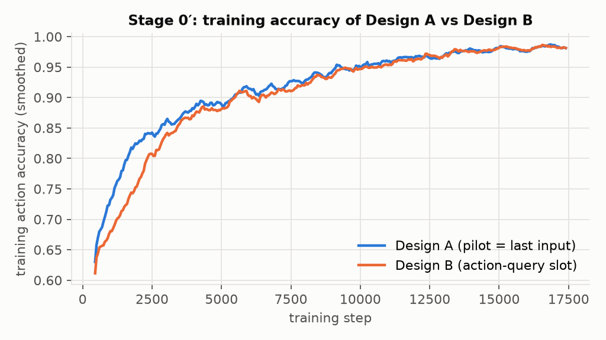
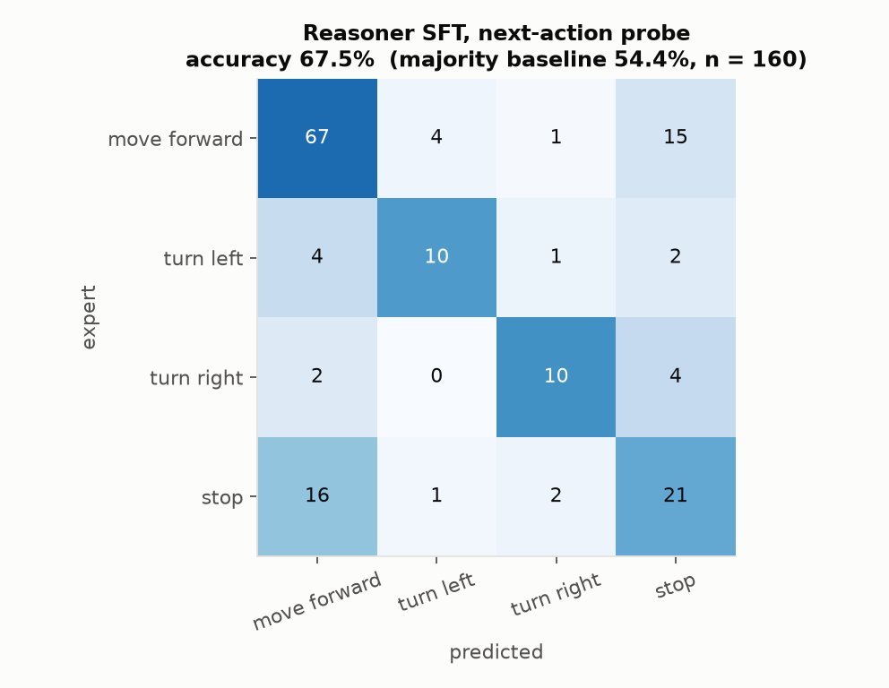

# Experiments

Every experiment run in this project, in the order it was run: the question it asked, why it was worth asking at that
point, how it was set up, what it measured, and what was decided because of it. Exact numbers for every run, with the log
file they come from, are in [`EXPERIMENT_LOG.md`](EXPERIMENT_LOG.md). Design decisions are numbered `D*` as in
[`../DECISIONS.md`](../DECISIONS.md).

**This is an evaluation study, not a new method.** Every trained model gets one round of offline imitation learning
on expert demonstrations and is then evaluated zero-shot in unseen buildings. LatentPilot's data flywheel, Robostral's
online RL fine-tuning, DAgger and any other on-policy data are **not** used. The numbers measure each idea's raw
capability, not its full recipe.

The work ran in three phases covering four architectures: Phase I is ① LatentPilot, Phase II is ② the pointing policy,
and Phase III covers ③ the Cosmos3-Edge action (diffusion) model and ④ the Cosmos3-Edge reasoner used as a policy.

- [0. Protocol](#0-protocol)
- [1. Phase I: LatentPilot as specified](#1-phase-i-latentpilot-as-specified)
- [2. Phase II: pointing supervision](#2-phase-ii-pointing-supervision)
- [3. Phase III: Cosmos3-Edge action model and reasoner](#3-phase-iii-cosmos3-edge-action-model-and-reasoner)
- [4. What carries across phases](#4-what-carries-across-phases)
- [5. Corrections to earlier reports](#5-corrections-to-earlier-reports)
- [6. Planned but not run](#6-planned-but-not-run)

---

## 0. Protocol

**Task.** R2R-CE (Vision-and-Language Navigation in continuous environments) in Habitat on Matterport3D. The agent
receives an English route instruction and egocentric RGB and chooses among FORWARD 0.25 m, LEFT 15°, RIGHT 15° and STOP.
The episode is capped at 100 primitive actions.

**Split.** All closed-loop numbers are on `val_unseen` (1,839 episodes, 11 scans never seen in training). An evaluation
of size `n` takes the **first n episodes** of the split, so `n = 40` covers 6 scans and `n = 150` covers 8. Numbers at
different `n` are on different episodes and are not paired.

**Metrics** (`src/eval/metrics.py`). NE is the final distance to the goal. OS (oracle success) means the agent came
within 3 m at any point. **SR** means the agent's own STOP was within 3 m (the standard definition). **end-SR** means
the episode *ended* within 3 m, by STOP or at the 100-step limit. The evaluation script's "SR" field is end-SR; SR is
recovered from the logged stopping positions where these exist. SPL weights end-SR by path efficiency. nDTW measures path
fidelity to the reference path; both paths are resampled to 0.25 m (D13).

**Two evaluation modes.** This distinction matters for every number in this document.

| Mode | Episode ends when | What "SR" measures | Used by |
|---|---|---|---|
| *diagnostic* (default) | the agent's own STOP, 100 steps, **or the agent coming within 3 m** | nothing beyond OS: SR = OS by construction | all Stage 0/0′/1, all Cosmos3-Edge and all reasoner evaluations |
| *strict* (`--strict`) | the agent's own STOP or 100 steps | end-SR; SR is recovered where stopping positions were logged | pointing evaluations marked strict |

Diagnostic mode was built to measure whether a policy can *reach* the goal before it had learned to stop. Its SR
column is reported here as **OS**. The only SR numbers in this project come from the later pointing runs.

**Tuning caveat.** Every STOP threshold and the turn threshold were chosen on `val_unseen`, the same split they are
reported on. A `val_seen` set (778 episodes) was collected to fix this, but was never used. Treat the best pointing numbers
as optimistic by the amount of that selection.

**Hardware.** One RTX 4070 Ti SUPER (16 GB). Backbone `nvidia/Cosmos-Reason2-2B` in bf16 (4.6 GB) with LoRA r = 16 on
the attention projections (6.4 M trainable parameters).

---

## 1. Phase I: LatentPilot as specified

**Why this idea.** If a VLM could reason in latent space instead of in words or extra frames, it would use far fewer
tokens per step, run faster, and reason visually in its native embedding space. LatentPilot is a concrete version of
this: one latent token per step is the model's only memory. **Not run here:** the paper's data flywheel (the model drives,
an expert corrects, the model retrains) and Stage 2 scheduled sampling.

LatentPilot adds a *Pilot Token* `z_t` to a VLN policy: a latent that is trained (`L_pil`) to predict the visual
embedding two steps ahead, `v̄_{t+2}`, and is fed back into the next step, so the policy "dreams ahead". The paper trains
in stages: Stage 0 (action loss only), Stage 1 (adds `L_pil` through a learned map `G_ψ`), and Stage 2 (scheduled
sampling). Code was not released, so every equation was re-derived from the paper ([`EQUATIONS.md`](EQUATIONS.md)).

### 1.1 Foundations: measure every silent assumption first (08-31)

These ran before any training, because each one could silently corrupt everything after it.

| # | Question | Why it mattered | Result | Decision |
|---|---|---|---|---|
| D5 | Is `v̄_{t+2}` predictable from `v̄_t` at all? | If the target is unpredictable, `L_pil` teaches noise | Forward retrieval over a 50-frame pool: 2.0× / 2.9× / 8.3× chance at 4 fps on three clips, but ≈ 1.0× at 2 fps | Operate at ≈ 4 fps; the Stage −1 gate passes |
| D5 | Do the paper's cosine thresholds (0.90 / 0.98) mean anything for this encoder? | The gate is written in raw cosine | Solid black vs solid white already has cosine 0.907; unrelated images average 0.752 | Judge by retrieval against chance, not raw cosine |
| D6 | Does feeding `inputs_embeds` keep Qwen3-VL's multimodal RoPE? | Pilot tokens must be injected as embeddings | No: it silently falls back to 1-D positions. Hidden-state relative L2 0.42–0.50, top-1 next token agrees on only 2/5 | Rebuild mRoPE ids explicitly, checked bitwise against `get_rope_index` |
| D7 | Is the cached target deterministic? | `L_pil` regresses to cached `v̄` | bf16 encoder output changes ~7 % (relative L2) with batch size; fp32 changes 8e-6 | Cache targets in fp32 |
| D8 | How to emit actions? | A new head would start from scratch | Map actions to existing vocabulary tokens through the native LM head; uniform loss is exactly ln 4 = 1.386 | Use vocab tokens |
| D9 | How are losses reduced? | `mean` over steps silently rescales λ | With `mean`, the effective λ was 0.15 instead of 0.1 at T = 6 | Sum within a trajectory, mean across the batch |
| D10 | Which token layout lets the untrained model follow instructions? | The paper's Eq. 5 order is ambiguous | 160 zero-shot trials, chance 25 %: literal Eq. 5 **21.2 %**, image-first with markers **77.5 %** (a first pass at 16 trials picked the wrong layout) | Image-first with markers, no chat template |
| D11–D14 | Are the metrics and the expert right? | Every later number depends on them | The shortest-path expert ignores language (caught by nDTW) → follow the reference path; literal nDTW gives 0.19 for a perfect expert, resampled 0.80; a perfect reference-follower scores SPL ≈ 0.92, matching the paper's own SPL/SR ratio of 0.911 | Reference-path expert, resampled nDTW, 3 m follower radius |

Expert rollouts: 1,665 train episodes (6 scans) and 1,839 `val_unseen` episodes, all validated (expert SR 1.000,
nDTW 0.753, NE 2.87 m). The action prior is 62–64 % FORWARD.

### 1.2 Stage 0: a memoryless policy cannot be the paper's baseline (09-01)

- **Question.** Does Stage 0 reproduce the paper's Table 3 "NaN" row (SR 51.7 / OS 57.0)?
- **Setup.** Train 8,000 steps × batch 8 on 6 scans with `L_act` only. Evaluate closed loop on 12 episodes of one scan
  (diagnostic).
- **Result.** Training accuracy rose to 0.78, but STOP recall stayed at 0.000. In closed loop, 10 of 12 episodes made
  **zero progress**: the policy spun in place (LEFT 44 %, RIGHT 43 %, FORWARD 13 %, against 62 % FORWARD in training).
- **Why.** Re-reading the supplementary material (A.1) showed that the NaN row still inserts the Pilot slot and carries
  `z_{t−1}` forward. It is a recurrent policy, not the memoryless one Stage 0 describes (D15).
- **Decision.** Build the recurrent Pilot slot and call it Stage 0′.

### 1.3 Stage 0′: where the Pilot slot goes decides whether it works (09-02)

- **Question.** Where should the Pilot token sit in the sequence: last (Design A), or paired with a separate action
  query (Design B)?
- **Zero-shot probe (D17).** On the untrained model, A kept 59.4 % instruction following and B kept 29.4 % (no slot:
  77.5 %). A was chosen.
- **Closed loop (D19).** Both designs were trained for 17,400 steps (2 epochs) on identical data, then evaluated on
  n = 150 (diagnostic). A scored **OS 0.0 %** and B scored **OS 16.7 %**. The probe had picked the wrong winner.
- **Slot-content ablation (D23, n = 60).** Replacing the slot's content with a constant or the current frame's embedding
  drops B to 0 %. With `z` it scores 18.3 %, and with rescaled `z` 21.7 %. Design A scores 0 % with every content.
  B's slot is load-bearing, and A's failure is architectural.

- **Lesson.** Zero-shot probes are good for ruling a design out, not for picking a winner. The same lesson returns in
  Phase III (§3.4).
- An infrastructure fix came out of this run (D24): checkpoints had been saving the full 4.9 GB model 37 times (180 GB).
  They now save the 33 MB adapter only.

### 1.4 Stage 1: the paper's claim, and the gate it failed (09-02)

- **Question.** Does learning `G_ψ` so that the Pilot token predicts `v̄_{t+2}` make a better *navigator*? This is the
  paper's central claim.
- **Why a control.** A lower `L_pil` could come from the extra loss alone. The control freezes `G_ψ` to the identity
  and changes nothing else.
- **Setup.** Design B, λ = 0.1, 17,400 steps × batch 8, 6 scans. `G_ψ` was initialised with zero weights and a mean-`v̄`
  bias. The default init made `λ·L_pil` 168× `L_act` at step 0; this init brings it to 0.42× (D20).
- **Result, n = 150, diagnostic.**

  | `G_ψ` | final training `L_pil` | OS | nDTW | NE (m) | own STOP |
  |---|---|---|---|---|---|
  | learned | **3.02** | 10.7 % | 0.277 | 8.50 | 4.7 % |
  | identity (control) | 6.80 | **17.3 %** | 0.268 | 8.17 | 0 % |

  The learned Pilot token *predicts* the future 2.25× better and *navigates* worse. At n = 30 the gap had looked like
  10 % vs 40 %; n = 150 shrank it, but the learned version still lost. The gate (D25) failed on both halves.
- **A contributing cause: the loss balance drifts** ([figure](figures/fig_loss_balance.png)). λ = 0.1 balances the two losses only at
  initialisation. `L_act` then falls ~51× and `L_pil` only ~4.8×. By step 17,400, `λ·L_pil` is 5.5× `L_act`, so most of
  the gradient goes to predicting frames rather than choosing actions.

  

- **The main cause: a train-time shortcut** (found after the fact, then measured in §7.1;
  [figure](figures/fig_slot_shortcut.png)). The Pilot slot is teacher-forced during training with the *true* embedding
  of the next frame, which reveals the action just taken. Training accuracy is 78 % without a slot (Stage 0) and 98 %
  with one (Stage 0′ and Stage 1); at matched steps (7k–8k) it is 78 % vs 92 %. On held-out steps the trained model is
  84 % accurate with the true next frame in the slot and 31 % with its own latent, which is what it gets at test time.

  

- **Follow-up: adaptive λ (D26).** λ was recomputed every step to hold `λ·L_pil / L_act` at 0.9; everything else was the
  same. The run was stopped at step 10,750. At step 10,000 it scored OS 6.7 % (n = 150), no better, while its own STOP
  rose to 18 %. Fixing the drift did not rescue the navigation, so the λ axis looked flat.
- **Decision.** Stop Phase I rather than stack more fixes on 6 scans and 1,665 episodes. This is a finding at 2 B
  parameters and small data, **not a refutation of the paper** (7 B, full data). Stage 2 was never run. A 16-scan
  Stage 1 was prepared but not trained.

---

## 2. Phase II: pointing supervision

**Why pivot.** Phase I's failures were all about the *output*: a 4-way classifier with a 62 % FORWARD prior that never
learned to stop. [Robostral Navigate](https://arxiv.org/abs/2607.20785) (§2.2), by Mistral AI, supervises an 8 B VLM to
*point* at the next waypoint in the image and leaves motion to a controller. It reaches 73.4 % with supervised
training on 2.4 M trajectories and 77.4 % after online RL. We test the raw idea: a 2 B model, supervised only, with **no
RL fine-tuning** and a geometric controller. This keeps the backbone's grounding ability and removes the
class prior from the learning problem (D27).

**Design.** The model outputs a point `(u, v)` in the image, a visibility flag and a STOP probability. A bearing
controller turns 15° if the bearing to the point is above 7.5° and otherwise moves forward. STOP fires when
`p(stop)` exceeds a threshold.

### 2.1 Are the labels right? (D27)

- **Question.** If the controller follows the pointing *labels*, does it reproduce the expert's own actions?
- **Result.** Naive labels agreed only **0.689** of the time. Three silent bugs were fixed in turn: in-place turn steps
  (→ 0.927), then one horizon shared by all actions and using the furthest instead of the first displaced waypoint
  (→ **0.972**). Using the furthest target alone dropped agreement from 0.93 to 0.75.
- **Why it mattered.** A policy cannot exceed its labels. At 0.69 agreement the ceiling was lower than Phase I's.
- A re-collection with per-step poses fixed a further ~6 % of steps whose yaw had been reconstructed 15° off.

### 2.2 First pointing policy (16 scans)

- 20,000 steps × batch 8 on 4,203 episodes (16 scans). At step 10k (n = 60) it reached OS 26.7 %, but never stopped on
  its own (mean `p(stop)` 0.013).
- **The first strict evaluation** (n = 150, threshold 0.05) gave **SR 13.3 % / OS 14.0 %**. Lowering the threshold makes
  the policy stop, but also stop early, which trades OS for SR.

### 2.3 Is the ceiling data or architecture? (data-scaling ablation)

- **Why.** "Pointing beats LatentPilot" compared 4,203 episodes against 1,665, a confound.
- **Setup.** The same run restricted to the 6 LatentPilot scans (identical steps, seed and schedule).
- **Result.** end-SR fell to **4.0 %** from 13.3 %, even though its training loss was *lower* (0.076 vs 0.396). It
  overfit.
- **Conclusion.** Data was the binding constraint. The next step was the full 61-scan training corpus (10,819 episodes).

### 2.4 Frame history (D28)

- **Question.** Does seeing earlier frames help? A single frame cannot tell "I just passed the door" from "the door is
  ahead".
- **Setup.** K = 2 history frames on the full 61 scans, 7 h (0.35 epoch). The run used stride 1 instead of the intended
  8, because of a launcher bug found afterwards.
- **Result.** end-SR **18.0 %**, OS 22.7 % (n = 150). This is not a clean ablation, because the data grew at the same
  time.

### 2.5 Long run, and what the policy actually uses (`pointing_full3`)

- 3-epoch schedule with K = 2 at stride 8, stopped at step 131k (1.2 epochs). The best end-SR was **24.7 %** (step 40k,
  threshold 0.10).
- **Does it read the instruction?** (teacher-forced, 900 held-out steps.) Action agreement was 0.764 with the real
  instruction, 0.686 with another episode's and 0.603 with none. STOP separation collapsed from 5.1× to 1.0×. The policy
  uses language, and STOP depends on it most.
- **Where is the STOP information?** A linear probe on every backbone layer (2,000 train / 1,000 test frames) found STOP
  AUC **0.718 at layer 15** and **0.441 at the final layer**, which is below chance. The head had been reading the one
  layer that carried the least STOP signal.

### 2.6 Multi-layer fusion head (D29): best SR in this project

- **Setup.** The head reads layers 23, 26 and 28 (chosen by searching 570 layer combinations with the probe). Otherwise
  it matches the long run: K = 2 at stride 8, 61 scans, a 1.5-epoch schedule stopped at step 124k (1.1 epochs).
- **Result.** At step 120k with threshold 0.20, n = 150: **SR 22.7 %** (own STOP within 3 m), end-SR 31.3 %, SPL 25.4 %,
  OS 42.7 %, nDTW 0.323, NE 7.22 m. Of the 69 own stops, 34 were within 3 m. 13 further episodes ended within 3 m
  only because they ran out of steps.
- **Honest reading.** At a matched point (threshold 0.20, similar epoch), fusion step 80k scored end-SR 22.7 % (SR
  12.7 %) and the final-layer head at step 60k scored 22.0 % (SR 16.0 %), so there was no benefit. end-SR over training is
  non-monotonic (15.3 → 30.0 → 22.7 → 18.7 → 31.3 %), so how much fusion itself adds is not established. Some of the headline number
  comes from choosing the checkpoint and threshold on the test split.

### 2.7 Why the pointing policy still fails

- **Failure analysis** (teacher-forced, 2,500 steps, one scan). Agreement is 0.901 on FORWARD but only 0.55 on turns.
  Missed turns become FORWARD (LEFT → FWD 0.388, RIGHT → FWD 0.428), almost never the wrong direction (LEFT → RIGHT
  0.059).
- **Why: shrinkage.** The predicted bearing is **0.424 ×** the true bearing (3,000 steps, 3 scans). Expert turns average
  41° but the prediction averages 27°, so many turns fall under the 7.5° threshold.

  

- **Would a lower turn threshold fix it?** A closed-loop sweep (diagnostic, n = 150) gave OS 35.3 / 41.3 / 42.0 /
  **42.7** / 40.0 % at 3 / 4 / 5 / 7.5 / 10°. It would not: lower thresholds turn more often but zig-zag. 7.5° was kept.
  The 42.7 % from this sweep is an OS number and was later quoted as the "pointing baseline". At the same settings,
  end-SR is 31.3 % and SR 22.7 %.

  
- **Rollouts** of `pointing_full3` step 100k: 6 of 22 episodes succeed by the model's own STOP. The 16 failures split
  into never approaching the goal, passing within 0.5 m without stopping, and stopping 3–10 m short
  ([`media/rollouts/step100k_failures/`](../media/rollouts/step100k_failures/)).

---

## 3. Phase III: Cosmos3-Edge action model and reasoner

**Why.** The pointing policy's errors are perceptual and temporal: it misses turns and stops in the wrong place.
`nvidia/Cosmos3-Edge` has a pretrained video-conditioned *action* stream (diffusion over ego-pose deltas) and a
*reasoner* tower trained on physical video. The question was whether either brings a motion prior that the 2 B
image-text backbone lacks.

### 3.1 Does Edge understand our ego-motion? (zero-shot inverse dynamics)

- From our rendered walking video, the `av` (driving) domain recovers yaw with correlation **+0.837** and turn direction
  96.4 % (384 frames, 11 scans). The `camera_pose` domain does worse (+0.288). On video re-rendered at a fixed 15 fps,
  yaw correlation reaches **+0.987**, and the translation scale fits **s = 7.47**, which all later runs use.
- **Conclusion.** The motion prior transfers to indoor walking.

### 3.2 Can Edge follow instructions? (zero-shot policy)

- With the full R2R instruction at guidance 1.0, turn direction is 59.4 % (a swapped instruction gives 53.1 %): close to
  chance.
- **Guidance sweep** on short commands ("turn left" / "turn right"): the sign is correct 82 / 86 / 95 / 95 % of the time
  at guidance 1 / 3 / 5 / 7.5. With full instructions at guidance 7.5, turn direction is 67.5 % vs 49.5 % swapped.
  Guidance ≈ 7.5 is required.
- **Closed loop** (n = 40, diagnostic): **OS 7.5 %**, with the policy stopping in 75 % of episodes. A fixed prompt, "The
  camera moves forward.", scored OS 15.0 % on n = 20, at least as well as the instruction.
- **Post-training** the action stream with flow matching was started (13 M trainable parameters, 6.3 s/step on 16 GB) and
  abandoned after one logged step; no checkpoint was saved.
- **Conclusion.** The motion prior is real, but instruction grounding is weak. Language has to come from elsewhere.

  

### 3.3 The reasoner as a policy

- **First look (qualitative).** Given a still frame, the reasoner produces plausible-looking waypoint lists. Asked
  for the next action, it narrates the scene as a bystander ("A person enters the room through the archway"). It does
  not know it is the camera, so an embodiment framing was added to every prompt (`src/nav/cosmos_prompts.py`).

  

- **Zero-shot.** On 160 decision points from 40 trajectories, next-action accuracy is **32.5 %** against a 54.4 %
  majority baseline. Thinking mode does not help (33.1 %).
- **SFT v1.** 43,036 samples with onset-balanced sampling (FORWARD 50 %, STOP 25 %), a 16-frame context and LoRA on
  the LM. Probe accuracy reached **67.5 %** (65.6 % at step 1,250). In closed loop (n = 40, diagnostic), step 1,250 scored
  **OS 0.0 %** and the final checkpoint **OS 17.5 %**, stopping in 65 % of episodes. Over-sampling decision onsets taught
  a turn-heavy, stop-happy policy.
- **SFT v3.** Uniform sampling (FORWARD 66 %, STOP 5 %) over a longer context (120 source frames, 8 of them sampled at
  1 fps), with projector LoRA added. Probe accuracy was **63.1 %**, lower than v1. In closed loop:

  | checkpoint | OS | nDTW | NE (m) | how episodes ended |
  |---|---|---|---|---|
  | step 1,500 | **47.5 %** | 0.389 | 6.41 | 19 reached 3 m, 16 timed out, 5 own STOP |
  | final | 32.5 % | 0.304 | 7.62 | 3 own STOP |

  

- **What 47.5 % does and does not show.**
  - It is the highest *oracle* success in the project, above the pointing policy's 42.7 %.
  - It comes from a diagnostic evaluation: none of the 5 own-STOPs fired within 3 m, and only 1 % of commands were
    STOP. SR was not measured, and would very likely be far lower.
  - It is one run with stochastic decoding (top-p 0.8, temperature 0.7) on 40 episodes (±15 points).
  - The v1 → v3 change altered three things at once (sampling, context, projector), so which one mattered is unknown.

- **What fails, and why.** Each version reproduces its training label mix. v1 (25 % STOP labels) ends 65 % of episodes by
  stopping, always more than 3 m from the goal. v3 (5 % STOP labels) rarely stops. Stopping also needs a sense of how much
  of the instruction is done, which 8 s of video cannot give.

  

### 3.4 Probe accuracy did not predict closed-loop success

| model | probe accuracy | closed-loop OS |
|---|---|---|
| SFT v1, step 1,250 | 65.6 % | 0.0 % |
| SFT v1, final | **67.5 %** | 17.5 % |
| SFT v3, final | 63.1 % | 32.5 % |

The same lesson appeared in Phase I (§1.3). Teacher-forced accuracy on held-out decision points does not measure
compounding error, recovery or stopping. Rank policies closed-loop.

---

## 4. What carries across phases

1. **Stopping is the hard part.** Every policy reached the goal region more often than it stopped there. The OS–SR gap
   is 11 points for the best pointing policy; the reasoner never stopped inside 3 m.
2. **Measure the gap between the eval and the claim.** A proximity break made SR identical to OS in most of this
   project's evaluations. A number reported as SR has to come from `--strict`.
3. **Zero-shot and teacher-forced probes rank badly.** Twice, in §1.3 and §3.4, a probe picked the wrong winner.
4. **Data dominates at this scale.** For the pointing policy, 6 → 16 scans tripled end-SR (4.0 → 13.3 %), and the
   61-scan runs with history reached 18–31 %.
5. **The final layer is not always where the answer is.** STOP was linearly decodable at layer 15 (AUC 0.72) and not at
   all at the output layer (0.44).
6. **Silent bugs were the largest single effects.** Losing mRoPE, the label bugs (0.69 → 0.97) and the wrong history
   stride each rivalled any modelling change. Most were caught only by measuring something the pipeline was assumed to
   get right.

---

## 5. Corrections to earlier reports

The first public README (commit `9ab89cb`) contained claims that a full audit of the logs does not support. All have been
corrected in the current README:

| Earlier claim | Correction |
|---|---|
| Reasoner v3 "SR 47.5 % / SPL 47.4 %", compared with the paper's SR 54.0 | Diagnostic mode: this is **OS 47.5 %**. SR was not measured; no own STOP landed within 3 m. |
| LatentPilot and reasoner tables labelled SR | All diagnostic: reported as OS |
| Pointing results: step 10k 26.7 %, full3 15.0 % | The first is diagnostic OS (n = 60). The best result (fusion, n = 150) and the history run were missing. |
| Pointing "strict SR 31.3 %" (second README) | The evaluation counted an episode as a success if it *ended* within 3 m, including at the step limit. With the standard definition (own STOP within 3 m) the best result is **SR 22.7 %**; 31.3 % is end-SR. SR is recoverable only for runs that logged stopping positions. |
| LatentPilot failure "because the loss balance drifts" | Drift is real but secondary: removing it did not help. The main cause is a train-time shortcut through the teacher-forced Pilot slot, measured in §7.1. |
| Reasoner v3 "OS 47.5 %" as its result | That was one stochastic diagnostic run. Three runs give OS 43.3 ± 7.2 %; strict evaluation gives **SR 3.3 %** (§7.5). |
| Pointing headline with a threshold tuned on the test split | Chosen on `val_seen` instead, SR is 23.3 % (§7.3). |
| Reasoner uses "a 16-frame context" | Only SFT v1 did. v3 samples 8 frames at 1 fps from 120 source frames. |
| "held-out `L_pil` 3.02 vs 6.80" | These are final *training* values. No held-out `L_pil` was computed. |
| "never learned to stop (`model_stop` 0–4.7 % in every checkpoint)" | The adaptive-λ checkpoint stopped in 18 % of episodes, and Stage 0′ in 30–39 % |
| Stage 1 step 10k rollouts come from `checkpoints/stage1_learned/step10000` | They come from an earlier, unlogged Stage 1 run whose checkpoint files were later overwritten. The step-10k → final comparison therefore spans two runs. |

Also: D26, D28 and D29 are referenced in scripts but have no entries in `DECISIONS.md`. They are described in §1.4, §2.4
and §2.6 above. The p-values quoted in two script headers (p = 0.333, p = 0.0055) have no recorded computation.

## 6. Planned but not run

- A 16-scan Stage 1, a constant λ = 0.02 arm, a longer Stage 2, and the paper's data flywheel.
- Greedy decoding for the reasoner (it was evaluated with stochastic decoding, three runs per setting).
- Most arms of the Cosmos prompt/policy ablation (`scripts/run_ablations.py`), which ran out of memory or were killed.
  Partial logs are in `results/salvaged/`.
- Flow-matching post-training of the Edge action stream.

---

## 7. Follow-up experiments (2026-09-30)

These answer the open questions above. The offline tests ran first; the closed-loop runs were then scheduled
unattended by `scripts/run_pending_followups.sh`. Every number is collected in
[`results/followups/summary.md`](../results/followups/summary.md).

### 7.1 Is the Pilot slot a shortcut? (`scripts/test_slot_shortcut.py`)

- **Question.** Does the trained LatentPilot read the action off the privileged next-frame embedding in its Pilot slot?
- **Setup.** 110 held-out `val_unseen` expert episodes (10 per scan, 11 scans, 4,306 steps). Observations and
  instruction are teacher-forced along the expert path. Each step is scored four times, changing only the slot:
  - the true next frame (the training input);
  - the model's own latent `z_{t-1}`, carried recurrently (the test-time input);
  - the current frame (real, but carrying no future information);
  - another episode's next frame (a real embedding that doesn't belong to this step).

  The cached embeddings were re-checked against freshly encoded frames: cosine 1.0000 on 72 random frames.
- **Result** (action accuracy):

  | Model | true next frame | own latent | current frame | other episode | no slot |
  |---|---|---|---|---|---|
  | Stage 0′ B (no `L_pil`) | 82.0 | 56.6 | 44.5 | 27.8 | |
  | Stage 1, learned `G_ψ` | 84.3 | 30.8 | 45.1 | 27.8 | |
  | Stage 1, identity `G_ψ` | 63.1 | 61.2 | 63.2 | 62.1 | |
  | Stage 0 (memoryless) | | | | | 66.0 |

  Over training (Stage 1 learned, 5 episodes per scan), own-latent accuracy falls from 48 % at 2k steps to 32 % at 4k
  and stays at 28–31 %. Next-frame accuracy stays at 78–87 %.
- **Conclusion.** Confirmed. The model reads the slot (28 % with a wrong next frame), relies on the privileged frame
  (84 %), and does worse than no memory at all with what it gets at test time (31 % vs 66 %). The shortcut comes from
  the teacher-forced *input*: Stage 0′ already shows it. Learning `G_ψ` makes the test-time latent worse.

### 7.2 Does Stage 2 (scheduled sampling) remove it? (`src/train/train_stage2.py`)

- **Setup.** Fine-tune Stage 1 (learned) for 2,600 steps at 0.1× learning rate on the same 6 scans (1,665 episodes;
  `--scans` added so it cannot silently use more). The share of slot inputs replaced by the model's own detached
  latent ramps up to 50 % or 75 %. The project's ground rules (`Agents.md` §5.4) require approval above 75 %.
- **Result.**

  | | own-latent accuracy (held-out) | next-frame accuracy | closed-loop OS (n = 150) |
  |---|---|---|---|
  | Stage 1, learned | 30.8 | 84.3 | 10.7 |
  | Stage 2, 50 % | 33.6 | 84.3 | 16.7 |
  | Stage 2, 75 % | 33.9 | 83.7 | 18.0 |
  | *identity control* | *61.2* | *63.1* | *17.3* |

- **Conclusion.** Navigation improves to the identity control's level (+6–7 points), but the shortcut stays: the model
  still prefers the true next frame and is barely better with its own latent. This short recipe does not fix the
  problem. A longer schedule or the paper's full flywheel remain untested.

### 7.3 The STOP threshold, chosen without the test split

- **Setup.** Fusion step 120k on `val_seen`: the 8 training buildings with the most episodes per MB, 159 new episodes.
  Strict, at τ = 0.10, 0.15, 0.20 and 0.30.
- **Result.** `val_seen` SR is 39.3 / 35.3 / 31.3 / 24.7 %, so τ = 0.10 is chosen. On `val_unseen` that gives **SR
  23.3 %** (end-SR 28.7 %, OS 36.7 %), against 22.7 % at the test-tuned 0.20.
- **Conclusion.** The headline was not an artefact of tuning on the test split.

### 7.4 Standard SR for the older pointing runs

Strict re-evaluation with stopping positions logged (n = 150): 16 scans **12.7 %**, + history **17.3 %**, longer schedule
(step 40k) **22.7 %**. end-SR, OS, SPL and NE reproduced the original runs exactly, since the simulator is
deterministic. Layer fusion at 120k equals the 40k final-layer model in SR (22.7 %), so fusion did not raise success.

### 7.5 The reasoner's real success rate

- **Setup.** SFT v3 step 1,500, n = 40. Three strict runs, where the episode ends only at its own STOP or the step
  limit, and two more diagnostic runs alongside the original one. Decoding is stochastic.
- **Result.** Strict SR 2.5 / 2.5 / 5.0 % (mean **3.3 %**), end-SR 17.5–20.0 %, OS 32.5–42.5 %. Diagnostic OS 47.5 /
  47.5 / 35.0 % (mean 43.3 ± 7.2).
- **Conclusion.** The reasoner reaches the goal region about as often as the best pointing model but almost never
  stops there. The single "47.5 %" overstated even its reaching ability.

